# 자바 언어의 특징

1. 가비지 컬렉터에 의한 자동 메모리 관리로 할당된 메모리 해제를 신경쓰지 않아도 된다.
2. 객체지향이다.
   1. 재사용성을 높일 수 있다.
      1. 코드의 재사용을 넘어선 객체의 재사용V
      2. 프로그램에 필요한 클래스 라이브러리들을 APIV로 제공함
3. 분산 처리에 용이하다.
   1. 분산환경에서 TCP/IP 프로토콜 사용할 수 있게 네트워크 기능 내장, 사용
   2. 원격 메서드 호출 라이브러리도 제공한다.
4. 인터프리터에 의해 실행된다.

   1. 컴파일언어가 아닌 인터프리터 언어다.
   2. 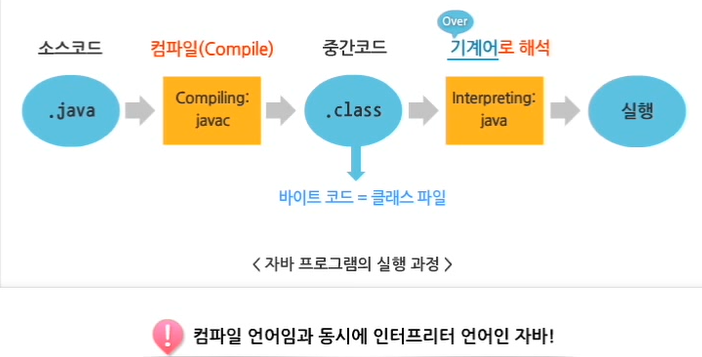

5. 자바는 견고 (Robust)하다.
   1. 포인터를 사용하지 않는다.
   2. 자동으로 가비지 컬렉션 기능
   3. 엄격한 데이터 타입 검사
   4. 실행 시간에 발생하는 에러를 처리한다.
6. 자바는 안전 (Secure)

   1. 분산 네트워크 환경에서도 실행될 수 있어야 하기 때문에.
   2. 컴파일 시에 데이터 타입을 검사한다.
   3. 

7. 플랫폼 독립적이다.
   1. 운영체제에 상관 없이 실행될 수 있다.
   2. 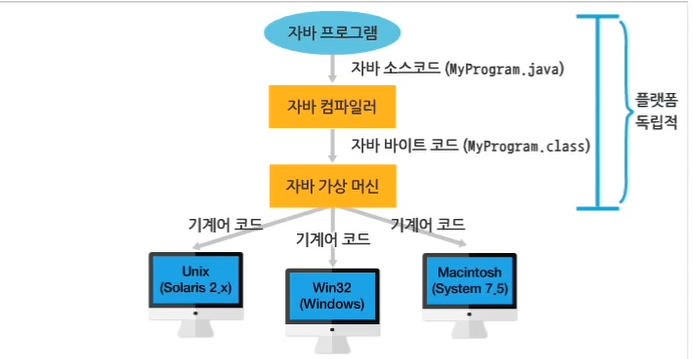
   3. 자바 프로그램의 이식성
8. 높은 성능
   1. 
9. 멀티 스레드를 지원한다.
   1. 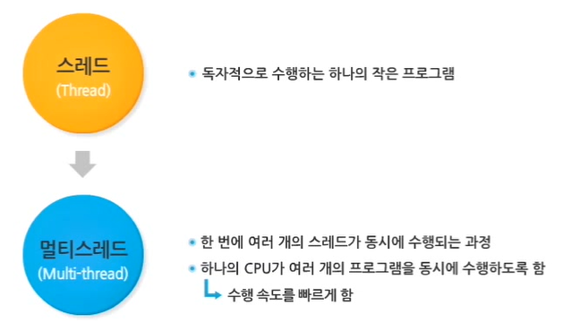
10. 동적 Dynamic 이다.
    1. 자바는 프로그램과 프로그램에서 사용되는 라이브러리와의 연결을 **실행 시간에 수행**한다.
       1. 라이브러리의 변화를 곧바로 적용할 수 있다.
    2. 기존의 프로그램에 영향을 주지 않고, 라이브러리에 새로운 메소드나 속성들을 추가할 수 있다.

# 자바 플랫폼

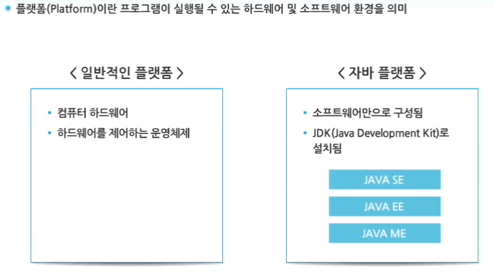

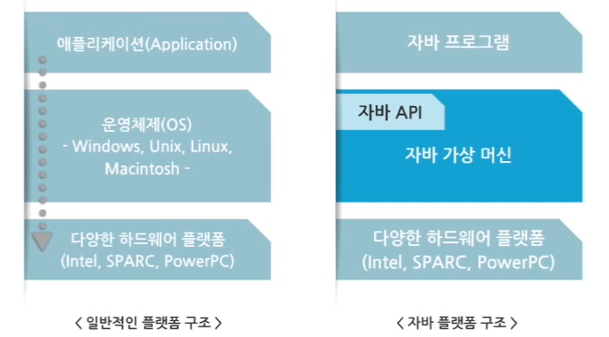

## 자바 가상 머신 (Java Virtual Machine)

- 운영체제가 다르면 같은 프로그램도 다르게 제작되어야 한다.
- 이 문제를 해결하기 위해 자바 가상머신 도입

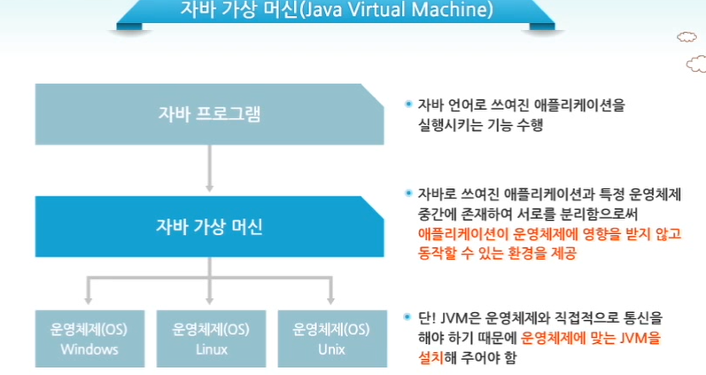

## 자바 API

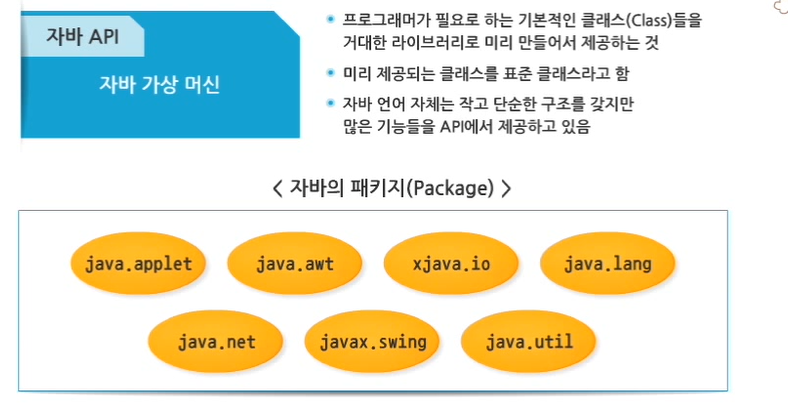

- 특히 자바는 관련 API들을 패키지로 묶어서 제공한다.
- 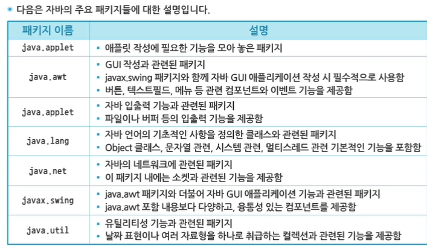

# 실습 환경 구축

## 1. 자바 개발 환경 (JDK)

- 자바 프로그램 개발을 위한 JDK
- 자바는 사용하려는 분야에 따라 세가지 플랫폼으로 구분된다.
- JSE 사용, oracle에서 다운
- JDK, SDK
- 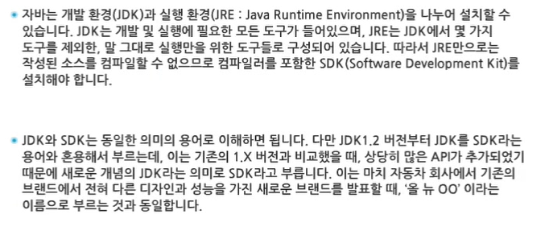

### JDK 폴더 구조

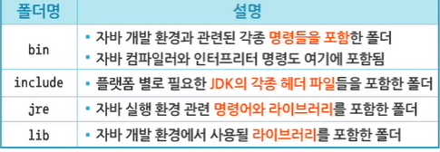

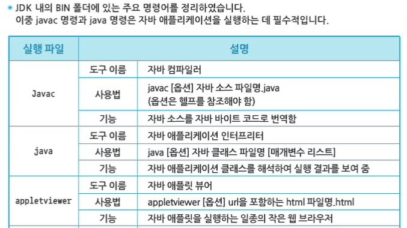

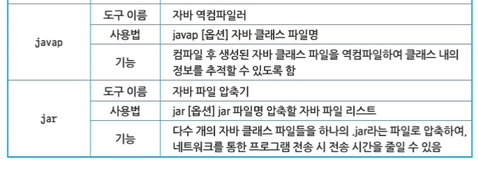

### 환경 변수

- bin 폴더 내의 명령어들은 bin 폴더 안에서만 쓸 수 있다.
- 시스템 환경 변수의 path 변수에 명령어들이 들어 있는 폴더를 추가해야 한다.
  - 자바의 컴파일, 인터프리터 등에 필요한 명령어들을 운영체제 등록하여, 모든 경로에서 자동으로 그 파일을 인식할 수 있게 만든다.
  - https://itons.net/%EC%9E%90%EB%B0%94-java-jdk-%EC%84%A4%EC%B9%98-%ED%99%98%EA%B2%BD%EB%B3%80%EC%88%98-%EC%84%A4%EC%A0%95%ED%95%98%EA%B8%B0/

### JDK Document

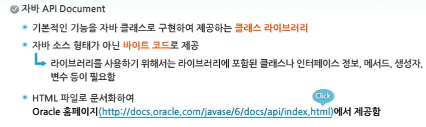

## 2. 자바 통합 개발 툴 (IDE)

- 이클립스 다운
- Eclipse IDE for Java EE Developers
