# [1] 자바 프로그램 기초

## 1. 자바 프로그램 구조

- 자바 프로그램은 .java 파일 하나에 클래스 하나를 정의
- 클래스 내부에 변수, 메서드 (또는 함수 정의)
- 자바에서 클래스는 최소 구성 단위

### 자바 주석문

```java
/ **
    * javadoc 형태의 주석 처리
    * 파일명 : 
	* 작성일 :
 	* 작성자 : 
*/
    
/* 다중 행 */
// 단일행
```


## 2. 자바 애플리케이션 작성 및 실행

- 자바 애플리케이션은 바이트 코드로 번역된 후 바로 실행할 수 있는 일반 프로그램
- 클래스 내에 'java'라는 명령어로 프로그램을 실행할 때 자동으로 호출되어 프로그램을 시작하는 main() 메서드를 가지고 있어야 함

### 컴파일 후 실행

1. `FirstApp.java` 파일에 작성

2. `javac FirstApp.java` => 컴파일 결과 : `FirstApp.class`

3. 컴파일된 클래스 실행 `java FirstApp`

### 이클립스 이용

1. New -> File -> java project 생성 
2. 프로젝트 명 (firstProject)의 src를 선택하고 우클릭 -> New -> Class , static main method 생성 체크
3. Ctrl + F11 자바 프로그램 실행
4. 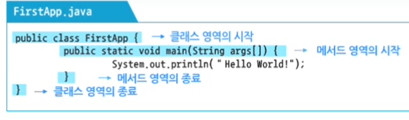


## 3. 자바 애플리케이션 구문 분석

### 자바 출력 문장

- `java.io 패키지` : 입출력 프로그램 구현
- 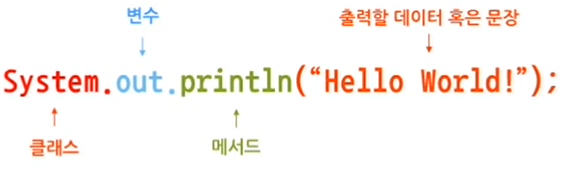

## 4. 식별자와 예약어

### 식별자

> 식별자, 변수, 메서드에 주어지는 이름, 각 요소의 식별을 가능하게 함

- <식별자 생성 규칙>

  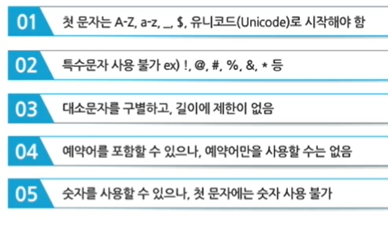

  - 관례상, <u>클래스 이름은 대문자/ 메서드 이름은 소문자/ 변수는 소문자/ 상수는 대문자로 시작</u>

### 예약어

> 시스템에서 일정 특성을 가진 언어로 등록된 것, 데이터 타입이나 프로그램 정의를 위해 사용됨


# [2] 자바 데이터 타입과 변수

## 1. 데이터 타입

- bit : 데이터 표현의 기본 단위, 0 1
- byte : bit가 8개 모이면 1byte가 되어 하나의 문자를 표현함 

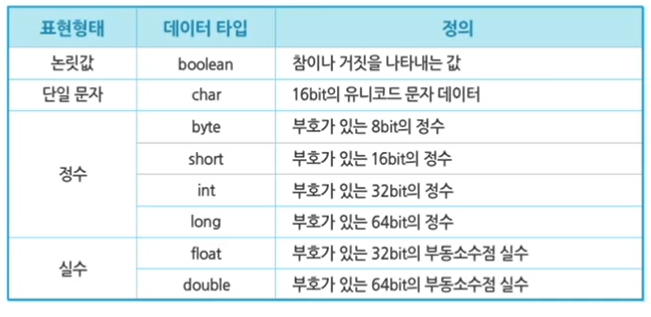

### 논리형(Logical)

- 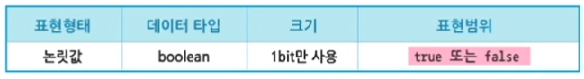
- boolean 형은 true와 false라는 두 literal 값이 있다.
  - literal : 각 자료형에서 사용할 수 있는 데이터 값을 의미
- int 형과 boolean 형은 서로 형변환 불가능

### 문자형 (Text)

- 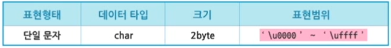
- char는 정수형으로 형변환 가능, 0부터 값을 갖는 Unsigned 값임
- 자바의 문자형은 16비트 유니코드 문자로 표현됨
  - 다른 언어는 8비트여서 아스키 값만 갖는다. 자바는 비영어권 문자도 고려.
  - 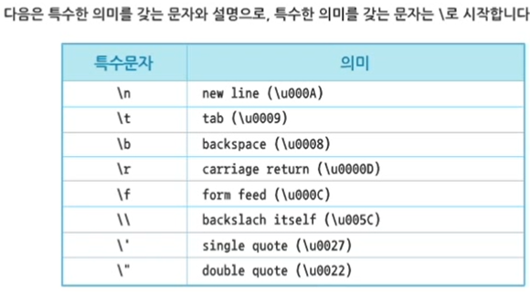

### 정수형 (Integer)

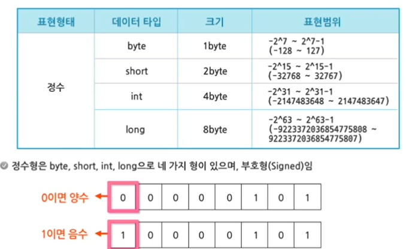

- 정수형 중 형을 명시하지 않는 int 형으로 기본 정의함

- 정수형은 Decimal, Octal, Hexadecimal로 표현

-  ```java
  23     : 10진수 표기법
  023    : 8진수 표기법
  0xBAAC : 16진수 표기법
      
  long 형을 사용할 경우 문자 L이나 l을 사용한다.
  23L, 023L, 0xBAACL
  ```

  

### 실수형 (Floating double)

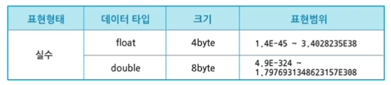

- 형을 명시하지 않으면 double이 기본형으로 정의됨

- 실수형 포맷은 표준인 IEEE 754를 채택하여 자바를 플랫폼 독립적인 언어로 만듦

- 실수형 리터럴은 소수점과 지수로 표현된다.

- ```java
  E 또는 e (지수 표현)
  F 또는 f (float를 표현)
  D 또는 d (double을 표현)
      
  3.14    : 간단한 실수 값 (double 형)
  6.02E23 : 큰 실수 값
  1.718F  : float 형의 실수 값
  ```


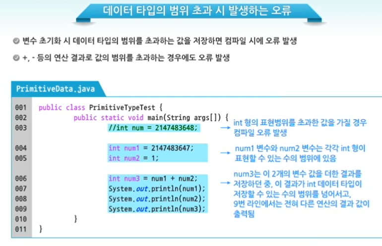

## 2. 변수의 선언과 초기화

- 변수 선언 : JVM에게 데이터를 저장하기 위한 메모리 할당을 요청하는 것
  - 데이터가 필요로 하는 크기의 메모리 할당을 위해 데이터 타입을 명시해야 함
  - 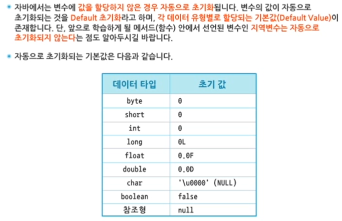

- 인스턴스 변수, 지역변수

## 3. 형변환

- 형 변환 시 작은 데이터 
- 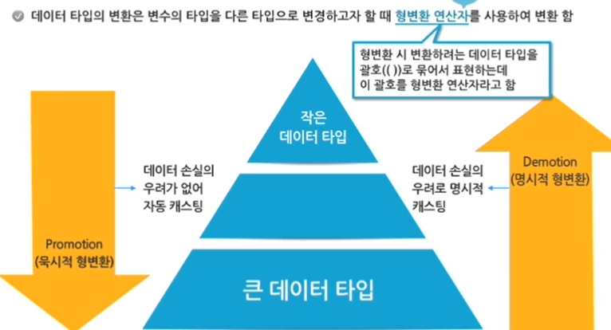

### 묵시적 형 변환 (Promotion)

- 형변환 연산자를 사용하지 않아도 자동으로 형변환이 이루어지는 경우 - 자동 형변환

  - ex) 4byte int 형을 8byte double 형으로 자동 변환 가능

- ```java
  int age = 25;
  double avgAge = age; // double  avgAge = (double)age
  					// 형변환 연산자인 (double) 생략
  ```

- 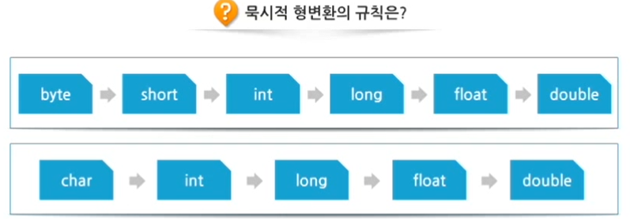

```java
public class PromotionTest {

	public static void main(String[] args) {
		
		byte b1 = 127;
		char c1 = '가';
		int i1;
		double d1;
		System.out.println("자동 형변환의 결과");
		
		i1 = b1; // byte=>int
				 // 127이라는 값이 1byte => 4byte로 표현됨
		System.out.println("i1 = b1의 형변환 : " + i1);
		
		i1 = c1; // char '가' => int 형
				 // '가' => 유니코드로 표현한 십진수값 44032
		System.out.println("i1 = c1의 형변환 : " + i1);
		
		d1 = i1; // int => double 형
				 // 44032 => 44032.0 (8바이트 실수)
		System.out.println("d1 = i1의 형변환 : " + d1);
		
		/*
			자동 형변환의 결과
			i1 = b1의 형변환 : 127
			i1 = c1의 형변환 : 44032
			d1 = i1의 형변환 : 44032.0
		*/
	}
}
```


## 명시적 형변환 (Demotion)

- 더 작은 범위를 나타내는 데이터 타입으로 변환되는 경우 (축소 형변환)

  - ex) 8byte double => 4byte int

- ```java
  // 명시적 형변환 후 다른 값을 가지게 되는 경우
  
  int sum = 128;
  byte data = (byte)sum; // b 변수에 -128 값 할당
  
  // - byte 변수가 가질 수 있는 범위 : -127 ~ 128
  // - 4byte로 표현된 128을 1byte로 축소하여 형변환
  // - b 변수가 byte 범위 밖의 128을 올바르게 표현할 수 없음
  ```

```java
public class DemotionTest {

	public static void main(String[] args) {
		
		byte b1;
		char c1;
		int i1 = 128;
		int i2 = 97;
		double d1 = 3.14;
		
		System.out.println("명시적 형변환의 결과");
		
		b1 = (byte) i1; // int => byte 명시적 형변환
				 	    // byte는 128을 표현할 수 없으므로 전혀 다른 값 -128이 저장됨
		System.out.println("b1 = (byte)i1 : " + b1);
		
		c1 = (char) i2; // int 97 => char 명시적 형변환
				 		// 97 => 유니코드 97인 소문자 a
		System.out.println("c1 = (char) i2 : " + c1);
		
		i1 = (int) d1; // double=> int 명시적 형변환
					   // 3.14 => 3 (소수점 아래 제외한 정수 부분만)
		System.out.println("i1 = (int) d1 : " + i1);

		/* 
		 	명시적 형변환의 결과
			b1 = (byte)i1 : -128
			c1 = (char) i2 : a
			i1 = (int) d1 : 3
		 */
	}
}
```

