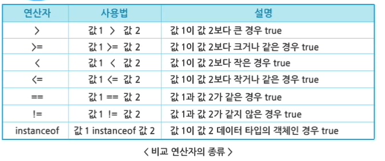
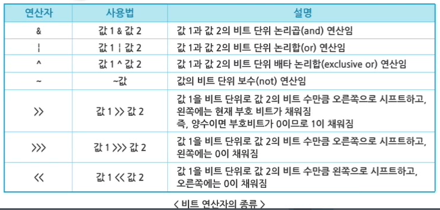
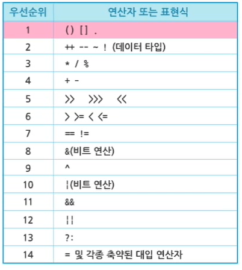
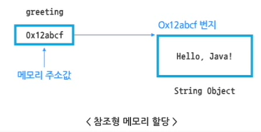
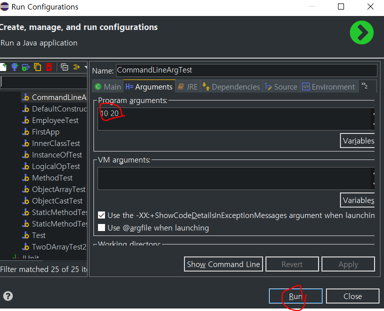

# 1. 자바 연산자

## 1. 산술 연산자

단항 연산자

- `++`, `--`

이항 연산자
- `+`, `-`, `*`, `/`, `%`
- //

## 2. 비교 연산자

대소 비교, 객체의 타입 비교 결과를 true/false boolaen 타입으로 리턴한다.




## 3. 논리 연산자

- and (`&`), or (`|`), not (`!`)
- 

```javapublic class LogicalOpTest {
public class LogicalOpTest {
	public static void main(String[] args) {
		int num1 = 9;
		int num2 = 2;
		int num3 = 0;
		
		// 1. && : 양쪽이 true인 경우면 true, 단 왼쪽이 false면 오른쪽 수행 x
		System.out.println((num1 == num2) && ((num1 / num3) > 0)); // false
		
		// 2. & : <둘 다 계산> 양쪽이 true인 경우면 true
		// System.out.println((num1 == num2) & ((num1 / num3) > 0));
		// 오른쪽 연산 error => / by zero
		
		// 3. || : 양쪽이 ture인 경우면 true, 단 왼쪽이 true면 오른쪽 수행 x
		 System.out.println((num1 != num2) || ((num1 / num3) > 0)); // true
		
		// 4. | : <둘 다 계산> 둘 중 하나라도 true면 true
		// System.out.println((num1 != num2) | ((num1 / num3) > 0)); 
		// 오른쪽 연산 error => / by zero
	}
}
```

## 4. 비트 연산자

- 값을 bit 단위로 연산



## 5. 기타 연산자 및 연산자 우선순위

### 1. 대입 연산자 `=`

+=, -=, *=, /=, %=, &= |=, ^=, <<=, <<<=, >>=

### 2. 조건 삼항 연산자 `(?, :)

`변수 = 조건 ? 값 1 : 값 2`


### 3. 연산자 우선순위




# 2. 자바의 배열

## 1. 배열의 개념

참조형의 메모리 할당과 구조

```java
String greeting; // String 자료형의 greeting 변수 선언 => greeting을 위한 메모리 공간이 할당됨
greeting = new String("Hello, Java!"); // greeting 변수에 값 할당
// String 객체를 생성하고, 객체의 시작 주소가 변수에 저장된다.
```



### 일차원 배열의 선언과 사용

```java
// 배열 객체를 참조할 배열 변수 선언 => 배열 객체 생성

// 1. 배열 선언
데이터타입 배열변수명[];
데이터타입[] 배열변수명;

int scoreList;
int[] scoreList;

// 2. 배열 객체 생성
배열 변수명 = new 데이터타입[배열의 길이];
scoreList = new int[100];

// 3. 배열 선언과 생성을 한 문장으로 사용하기
int scoreLost[] = new int[100];
int[] scoreList = new int[100];

// 4.배열 생성과 초기화를 한 문장으로 표현하기
int[] scoreList = { 45, 80, 100, 59, 80 }; // 초기값을 나열해줌으로써 자동적으로 배열 객체 생성
scoreList = new int[] { 45, 80, 100, 59, 80 }; // 마지막으로 배열 객체를 명시적으로 생성하면서 초기 값 지정
```


### `length`와 index

```java
int[] scoreList = new int[100];
scoreList[0] = 1;
scoreList[99] = 100;

scoreList[100] = 98; // 100번째 인덱스는 존재하지 않기 때문에 오류

System.out.println(scoreList.length);
```

```java
public class ObjectArrayTest {
	public static void main(String[] args) {
		String nameList[] = { "Java", "SQL", "Servlet" };
		System.out.println("nameList 길이 = " + nameList.length);
		System.out.println("< nameList 배열 요소 출력 >");
		System.out.println(nameList[0] + '\t');
		System.out.println(nameList[1] + '\t');
		System.out.println(nameList[2]);
//		nameList 길이 = 3
//		< nameList 배열 요소 출력 >
//		Java	
//		SQL	
//		Servlet
	}
}
```


## 2. 다차원 배열

```java
// 동일한 길이로 생성된 일차원 배열을 참조하는 형태
scoreList = new int[3][4]; // 3 X 4

또는
scoreList = new int[3][];
scoreList[0] = new int[4];
scoreList[1] = new int[4];
scoreList[2] = new int[4];
```


```java
// 서로 다른 길이로 생성된 이차원 배열도 가능
// 첫 번째 배열 첨자까지만 지정한다.
int[][] scoreList = new int[3][];
scoreList[0] = new int[2];
scoreList[1] = new int[3];
scoreList[2] = new int[4];
```


```java
public class TwoDArrayTest2 {
	public static void main(String args[]) {
		// 서로 다른 길이로 생성된 일차원 배열을 참조하는 이차원 배열 형태
		String[][] scoreList = new String[3][];
		
		scoreList[0] = new String[2];
		scoreList[1] = new String[3];
		scoreList[2] = new String[4];
		System.out.println("< 2차원 배열의 인덱스 출력 >");
		
		for (int i = 0; i < scoreList.length; i++) {
			for (int j = 0; j < scoreList[i].length; j++) {
				scoreList[i][j] = "[" + i + "][" + j + "]요소";
				System.out.print(scoreList[i][j] + "\t");
			}
			System.out.println(" ");
		}
		
//		< 2차원 배열의 인덱스 출력 >
//		[0][0]요소	[0][1]요소	 
//		[1][0]요소	[1][1]요소	[1][2]요소	 
//		[2][0]요소	[2][1]요소	[2][2]요소	[2][3]요소	 
	}
}
```


### 명령형 매개변수

```java
public class CommandLineArgTest { // class 정의(선언)
    public static void main(String args[]) { // main() 메서드를 정의하여 class를 실행함
        // main(String args[] : 명령형 매개변수
        // => 문자의 배열을 매개 변수로 받아, 프로그램 실행 시 필요한 정보를 프로그램에 전달함
        // 실행될 코드
    }
}
```

`main(String args[])` => 명령형 매개 변수

- 문자열의 배열을 매개변수로 받아, 프로그램 실행 시 필요한 정보를 프로그램에 전달함
- 사용자가 명령행 매개변수로 입력한 문자열의 순서에 따라 차례대로 배열에 저장됨
  - `java CommandLineArgTest arg1 arg2`
- 명령행 매개변수에 해당하는 배열은 문자열 타입으로, 숫자 사용 시 문자열을 숫자로 변환해야 함
  - 자바 API에서 메서드 제공	
    - Integer 클래스의 parseInt(), Double 클래스의 parseDouble()


### 명령형 매개변수가 필요한 프로그램 실행 방법

#### 1. DOS 창에서 컴파일 후 실행

`CommandLineArgTest.java` 파일 경로로 이동

```powershell
javac CommandLineArgTest.java
-----                    ----
컴파일 진행                프로그램 실행

java CommandLineArgTest 10 20

매겨변수로 받은 정수의 합 : 30
```

#### 2. Eclipse 이용

Run -> Run Configurations -> Arguments 탭 이동

