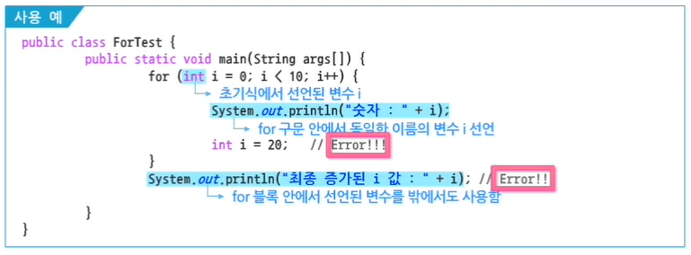

# 1. 자바 제어문

## 1. 조건 제어문

### 1. `if~else if`

```java
public class IfElseIfTest {
	public static void main(String[] args) {
		int month = Integer.parseInt(args[0]);
		
		if (month == 3 || month == 4 || month == 5) {
			System.out.println(month + "월은 봄입니다.");
		} 
		else if (month == 6 || month == 7 || month == 8) {
			System.out.println(month + "월은 여름입니다.");
		} 
		else if (month == 9 || month == 10 || month == 11) {
			System.out.println(month + "월은 가을입니다.");
		}
		else if (month == 12 || month == 1 || month == 2) {
			System.out.println(month + "월은 겨울입니다.");
		}
		else {
			System.out.println("1~12월 사이의 숫자만 입력하세요.");
		}
	}
}

```


### 2. `switch` 문

switch문의 Expression 결과는 char, byte, short, int 형만이 가능하다.

```java
public class SwitchTest {
	public static void main(String[] args) {
		int month = Integer.parseInt(args[0]);
		
		switch(month) {
			case 3:
			case 4:
			case 5:
				System.out.println(month + "월은 봄입니다.");
				break;
			case 6:
			case 7:
			case 8:
				System.out.println(month + "월은 여름입니다.");
//				6월은 여름입니다.
				break;
			case 9:
			case 10:
			case 11:
				System.out.println(month + "월은 가을입니다.");
				break;
			case 12:
			case 1:
			case 2:
				System.out.println(month + "월은 겨울입니다.");
				break;
			default: // case에 예외되는 값을 입력할 경우
				System.out.println("1~12월 사이의 숫자만 입력하세요.");
				break;
		}
	}
}
```


## 2. 반복 제어문

### 1. `for` 문

for 블록을 포함하는 메서드 내에서 선언된 변수와 같은 이름으로 선언할 수 없다.

for 블록 내의 변수는 외부에서 호출이 불가능하다.




```java
public class ForTest {
	public static void main(String[] args) {
		int sum = 0;
		for (int i = 0; i <= 100; i++) {
			if ((i % 2) == 0) {
				sum = sum + i;
			}
		}
		System.out.println("1~100 사이의 짝수의 합 : " + sum);
//		1~100 사이의 짝수의 합 : 2550
	}
}
```


### 2. `while` 문

### 3. `do~while` 문

반복 블록이 표현식 앞에 있으므로, 표현식이 false라도 반복문을 최소한 한번은 실행함

```java
public class WhileTest {
	public static void main(String[] args) {
		int i = 6;
		
		while (i <= 5) {
			System.out.println(i);
			++i;
		}
		
		int j = 6;
		
		do {
			System.out.println(j);
			++j;
		} while (j <= 5);
		// 6
	}
}
```


## 3. 이동 제어문

1. `break`
   - switch문 => 수행을 중단하고 switch 블록을 종료할 때 사용
   - 반복 문에서 쓰일 경우, 수행을 중단하고 반복문 자체를 종료할 때 사용
2. `continue`
   - 반복문 (for, while) 문에서 **현재 단계 수행 생략**, 다음 단계로 계속 진행
3. `return`
   - 메서드 수행 종료, 메서드가 호출된 곳으로 제어를 이동시킴

4. Label을 사용한 `break`와 `continue`
   - Label로 인해 프로그램이 복잡해질 우려가 있어 사용 권장x

```java
		// break와 continue에서 Label을 사용하면, 
		// Label이 정의된 영역만큼 break와 continue가 적용됨
		outer: for (int i = 0; i < 4; i++) {
				if (i == 2)
					continue outer;
				System.out.println("i = " + i);
		}
//		i = 0
//		i = 1
//		i = 3
```

