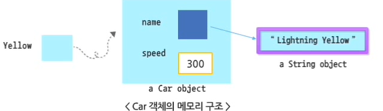

# 1. 클래스의 구조와 객체 생성

## 1. 클래스의 구조

- 클래스의 선언부와 몸체로 나뉘고 몸체에는 클래스의 멤버가 선언됨
- 클래스의 멤버 구성
  1. 객체 초기화 - 생성자 Constructor
  2. 클래스의 속성 정의 - 멤버 변수  Variable
  3. 클래스의 데이터를 조작, 변환 - 메서드 Method

```java
// Employee.java
public class Employee {
	// 멤버 변수
	private String name; 	// 이름
	private int number;		// 사번
	private String dept;	// 근무 부서
	
	// 생성자
	public Employee(String name, int number, String dept) {
		this.name = name;
		this.number = number;
		this.dept = dept;
	}

	// 메서드
	public String getName() {
		return name;
	}
	
	public void setName(String name) {
		this.name = name;
	}
	
	public int getNumber() {
		return number;
	}
	
	public void setNumber(int number) {
		this.number = number;
	}

	public String getDept() {
		return dept;
	}
	
	public void setDept(String dept) {
		this.dept = dept;
	}
}
```


### 클래스 Modifier

| 접근 권한 예약어                      | 활용 방법 예약어                                             |
| ------------------------------------- | ------------------------------------------------------------ |
| public, protected, private, (default) | **final**, **abstract**, static, trainsient, volatile, synchronized, native |

1. public : 모든 클래스에서 접근 가능한 클래스
2. `final` : 자식 클래스를 가질 수 없는 클래스
3. `abstract` : 객체 생성이 불가능한 추상 클래스
4. 접근 권한 관련 Modifier를 지정하지 않으면, 같은 패키지 내의 클래스에서만 접근 가능
5. 서로 다른 패키지의 클래스 접근 - public


### 클래스의 UML 표기법

> Unified Modeling Language
>
> - 소프트웨어 개념을 다이어그램을 그리기 위해 사용하는 시각적 표기법
>
> - 객체지향 프로그램 시각화, 시스템 사양, 설계를 문서화
> - <u>시스템 구성 클래스들과 클래스들 사이의 관계를 그림으로 표현</u>

<UML 기반의 클래스 표기법>

| Car // 클래스 이름                                  |
| --------------------------------------------------- |
| name<br />speed // 변수                             |
| setName()<br />setSpeed()<br />getSpeed() // 메서드 |


## 2. 객체 생성

#### 자바의 변수 

- 기본형 변수
- 참조형 변수 - 배열 객체나 일반 클래스의 객체를 처리할 때 사용

#### 배열 객체 사용

1. 객체 참조 변수의 선언 - `int[] scoreList;`
2. 객체 생성 및 주소값 할당 - `scoreList = new int[5];`

#### 객체 생성

특정 클래스 유형의 객체 참조 변수 선언

1. 클래스이름 객체참조변수이름; => `Car Yellow;`
2. 객체 생성: 객체참조변수이름 = new 클래스 이름(); => `Yello new Car();`

- 객체가 사용할 메모리 영역을 할당하는 과정 => 예약어 `new`
- 생성된 객체에 대한 참조 값 (일종의 메모리 주소)이 선언된 객체 참조 변수에 할당
- `Car Yellow = new Car();`



```java
class Car {
	String name;
	int speed;
}
```

```java
public class CarTest2 {

	public static void main(String[] args) {
		Car Yellow = new Car(); // Car 유형의 Yellow 변수를 선언하고
								// Car 클래스로부터 객체를 생성하여 주소 값을 할당함
		
		Yellow.name = "Lighting Yellow"; // String type의 참조형 변수로, 문자열 객체의 주소값 저장됨
		Yellow.speed = 3000;			 // 기본형 변수
		System.out.println(Yellow.name + " : " + Yellow.speed);  // Lighting Yellow : 3000
		
		// 하나의 클래스로부터 여러 개의 객체 생성 가능
		Car red = new Car();
		red.name = "Sally Red";
		red.speed = 200;
		System.out.println(red.name + " : " + red.speed);	// Sally Red : 200

	} 

}
```


### 멤버 변수의 선언

- [modifier] 데이터타입 변수이름;
- modifier에서 변수에 대한 접근 권한, 활용 방법 제어
- modifier 미지정 시 같은 패키지 내의 클래스에서만 접근 가능한 객체 변수

| 전역 (Global) 변수                                           | 지역 (Local) 변수                                            |
| ------------------------------------------------------------ | ------------------------------------------------------------ |
| - 클래스 선언부 밑에 선언된 변수로 **멤버 변수**라고 칭함<br />- 여러 메서드에서 공통으로 사용 가능<br />- <u>객체가 가질 수 있는 속성<u>을 나타내는데 사용됨 | - 메서드 선언부 밑에 선언된 변수<br />- 해당 변수가 선언된 메서드 내에서만 사용 가능 |


<멤버 변수에 사용되는 Modifier>

| 구분      | Modifier  | 설명                                                         |
| --------- | --------- | ------------------------------------------------------------ |
| 접근 권한 | private   | 해당 클래스에서만 접근 가능                                  |
|           | default   | 해당 패키지 내에서만 접근 가능                               |
|           | protected | 동일 패키지 내 클래스 / 해당 클래스 상속받은 외부 패키지 클래스 접근 가능 |
|           | public    | 어떤 클래스라도 접근 가능                                    |
| 활용 방법 | final     | 변수를 상수로 이용하는 경우                                  |
|           | static    | 클래스에 소속된 클래스 변수                                  |


### 접근 제한자 (Accees Modifier)

- 접근 제한자로 <u>정보 은닉</u>을 구현할 수 있다.

|   종류    | 클래스 | 하위 클래스 | 동일 패키지 | 모든 클래스 |
| :-------: | ------ | ----------- | ----------- | ----------- |
|  private  | O      | X           | X           | X           |
| (default) | O      | X           | O           | X           |
| protected | O      | O           | O           | X           |
|  public   | O      | O           | O           | O           |


접근 제한자와 정보 은닉의 관계


```java
class Car {
	private int serialNumber; 	// 외부 클래스 접근 불가
	protected String name; 		// 동일 패키지 접근 가능
	int speed;					// 동일 패키지, 하위 클래스 접근 가능
	
	public int getSerialNumber(int managerId) {
		if (managerId == 12345) {
			return serialNumber;
		}
		return 0;
	}
	
	public void setSerialNumber(int serialNumber) {
		this.serialNumber = serialNumber;
	}
}

public class Test {

	public static void main(String[] args) {
		Car Yellow = new Car(); 
		
		Yellow.name = "Lighting Yellow"; // protected => 동일 패키지/ 하위 클래스 접근 가능
		Yellow.speed = 3000;			 // default => 동일 패키지 접근 가능
		Yellow.setSerialNumber(4929);	 // private => 외부 클래스 접근 불가능
										 // setserialNumber() 메서드로 값 설정
		
		System.out.println(Yellow.name + " : " + Yellow.speed);  		 // Lighting Yellow : 3000
		System.out.println("Car No : " + Yellow.getSerialNumber(12345)); // Car No : 4929
	}

}
```


# 2. 멤버 메서드

## 1. 멤버 변수

### 메서드 (Method) 정의하기

메서드 구성요소

1. 반환형 (Return_type) : 기본형, 참조형 모두 올 수 있다. 아무것도 리턴하지 않으면 void로 선언
2. 메서드명 : 식별자(Identifier)의 규칙에 따른다.
3. 매개변수(Parameter) : 메소드 수행 시에 전달되는 인자의 타입과 변수명
4. 접근 제한자 (Access Modifier) : 생략 가능

```java
// 메서드 선언
public int sum(int num1, int num2) {
 				// (Parameter 매개 변수)
}
// 메서드 호출
sum(4, 7); // (Argument 인자)
```


### 메서드 Modifier

| 구분      | Modifier     | 설명                                                         |
| --------- | ------------ | ------------------------------------------------------------ |
| 접근 권한 | public       | 모든 클래스 접근 가능                                        |
|           | protected    | 동일 패키지 / 하위 클래스 접근 가능                          |
|           | private      | 클래스 내에서만 접근 가능                                    |
| 활용 방법 | **final**    | Overriding 불가능한 메서드 정의                              |
|           | **static**   | 클래스에 소속된 **클래스 메서드** - <u>클래스 생성 시 만들어진다.</u> |
|           | **abstract** | **추상 메서드** - <u>하위 클래스에서 구현된다.</u>           |
|           | synchronized | Thread 동기화를 위한 메서드                                  |

```java
public class MethodTest {
	public static void main(String[] args) {
		int[] enScore = {55, 70, 45, 90, 100, 90, 95};
		System.out.println("영어 평균 : " + getAvgScore(enScore));
		
		int[] korScore = {93, 55, 87, 80, 100, 95, 65};
		System.out.println("국어 평균 : " + getAvgScore(korScore));
		
	}
	
	private static double getAvgScore(int[] scoreList) {
		int sum = 0;
		double avgScore = 0.0;
		for (int i = 0; i < scoreList.length; i++) {
			sum = sum + scoreList[i];
		}
		
		avgScore = (double)sum/scoreList.length;
		return avgScore;	
	}

	// 영어 평균 : 77.85714285714286
	// 국어 평균 : 82.14285714285714
}
```


## 2. 메서드

### 메서드 종류

1. 리턴값X, 매개변수X
2. 리턴값X, 매개변수O
3. 리턴값O, 매개변수O


### 메서드의 자동 구현

- 멤버 변수들은 대부분 private로 선언, 외부에서는 숨겨진 형태로 만듦
- public 메서드를 통해 접근하도록 클래스를 구현함
  - Getter / Setter 메서드
  - 이는 **정보 은닉**의 기본
  - 이클립스는 private 변수에 대한 public Getter, Setter 메서드를 자동으로 구현할 수 있게 해준다.
    - <Alt> + <Shift> + <S> + Generate Getters and Setters / toString

```java
// Employee.java
public class Employee {
    //	private String name; 		
	String name; 	// 이름
	int number;		// 사번
	int age;		// 나이
	String title;	// 직함
	String dept;	// 근무 부서
	String grade;	// 인사고과 또는 등급
	
	// <Alt> + <Shift> + <S> => Getter, Setter, toString() 메서드 자동 생성하기
	
	@Override
	public String toString() {
		return "Employee [name=" + name + ", number=" + number + ", age=" + age + ", title=" + title + ", dept=" + dept + ", grade=" + grade + "]";
	}
	
    // Getter and Setters .. 
	public String getName() {
		return name;
	}
	public void setName(String name) {
		this.name = name;
	}
}
```

```java
// EmployeeTest.java
public class EmployeeTest {

	public static void main(String[] args) {
		Employee kim = new Employee();
		kim.name = "김재준";
		kim.number = 12345;
		kim.age = 32;
		kim.title = "영업과장";
		kim.dept = "영업부";
		kim.grade = "A+";
		
		System.out.println("직원의 정보1 : " + kim.toString());
		System.out.println("직원의 정보2 : " + kim); // toString() 자동 호출
		
		// 직원의 정보1 : Employee [name=김재준, number=12345, age=32, title=영업과장, dept=영업부, grade=A+]
		// 직원의 정보2 : Employee [name=김재준, number=12345, age=32, title=영업과장, dept=영업부, grade=A+]

	}
}
```

