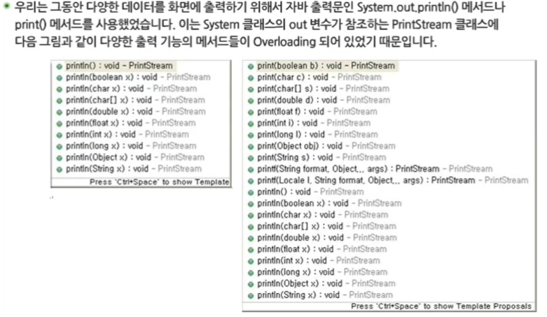
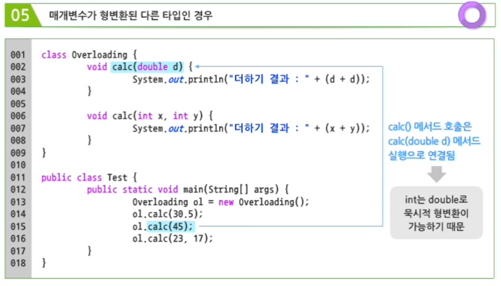
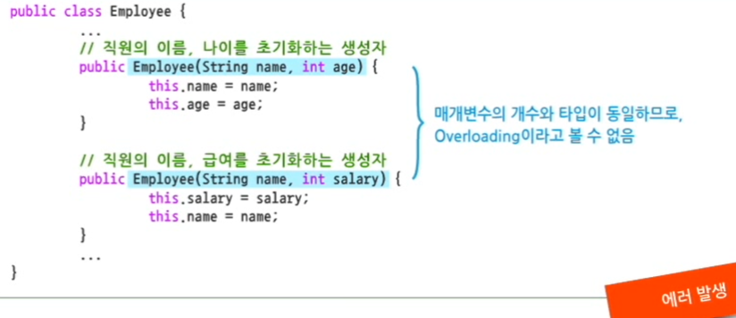
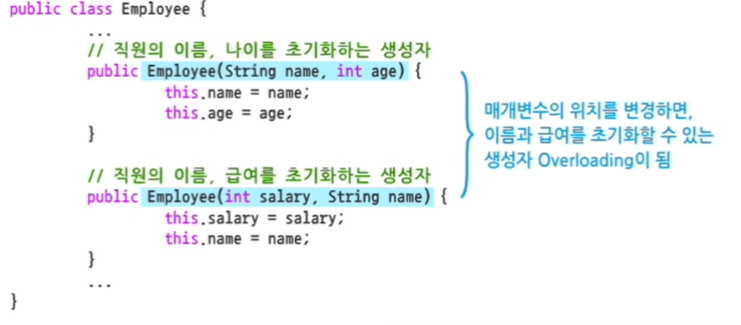
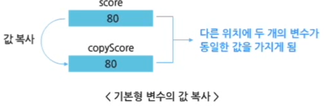
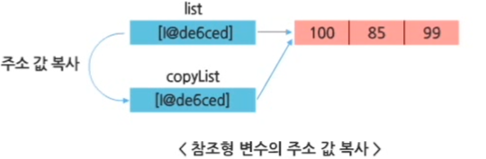
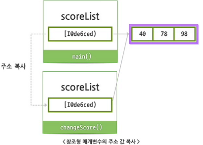

# 1. 메서드 Overloading

## 메서드 Overloading

### 변수의 중복 선언

- 변수와 달리 하나의 클래스에 동일한 이름의 메서드는 여러 개 정의할 수 있음
- 데이터 타입이 달라도 변수 이름이 동일한 경우를 허용하지 않음


### 메서드의 중복 정의 (Overloading)

- 매개변수의 개수와 타입을 통해 실행될 메서드를 구분할 수 있기 때문에, 하나의 클래스에 동일한 이름의 메서드를 여러 개 정의할 수 있다.

- 메서드 오버로딩은 객체 지향 같은 객체지향 언어에서만 제공되는 문법이다.


### PrintStream 클래스의 메서드 Overloading



### 메서드 Overloading 유형

1. 매개변수의 개수와 타입이 모두 다른 경우 => O
2. 리턴 타입이 다른 경우 => X, 오버로딩 시 리턴 타입은 무시되어 에러 발생
3. 매개 변수의 이름이 다른 경우 => X, 매개변수의 이름은 외부로부터 값을 받아오기 위함에 불과함
4. 매개변수의 개수와 타입이 같지만 순서가 다른 경우 => O
5. 매개변수가 형변환된 다른 타입인 경우
   - int는 double로 묵시적 형변환이 가능하다.



## 생성자 Overloading

- 생성자는 클래스로부터 객체를 생성할 때 객체의 변수들을 초기화하는 역할을 담당하는 메서드.
- 생성자 또한 메서드 Overloading이 지원된다.
  - 하나의 클래스는 매개변수의 유형과 개수를 달리해서 여러 개의 생성자를 갖도록 한다.
  - 필요한 데이터로만 초기화된 객체들을 사용 가능하다.

```java
class Employee {
	String name;
	int age;
	int salary;

	// 기본 생성자
	public Employee() {
	}

	// 생성자 Overloading
	public Employee(String name, int age) {
		this.name = name;
		this.age = age;
	}

	public Employee(String name, int age, int salary) {
		this.name = name;
		this.age = age;			// 중복되는 코드가 있음
		this.salary = salary;
	}
}

class EmployeeTest {
	public static void main(String[] args) {
		Employee kim = new Employee();
		System.out.println(kim.name + "의 나이 : " + kim.age + ", 의 급여 : " + kim.salary);
		
		Employee lee = new Employee("이선영", 45);
		System.out.println(lee.name + "의 나이 : " + lee.age + ", 의 급여 : " + lee.salary);
		
		Employee park = new Employee("박재성", 28, 220);
		System.out.println(park.name + "의 나이 : " + park.age + ", 의 급여 : " + park.salary);
	}
}
// null의 나이 : 0, 의 급여 : 0
// 이선영의 나이 : 45, 의 급여 : 0
// 박재성의 나이 : 28, 의 급여 : 220
```







### `this()`의 의미와 사용법

1. `this` 예약어
   - 생성자나 메서드의 매개변수 이름이 객체 변수의 이름과 같은 경우, this.객체변수이름 으로 구별
2. `this()` 생성자
   - 같은 클래스  내의 Overloading 된 다른 생성자 메서드를 호출할 때 사용함

```java
public class Employee {
	int employeeNo;
	String name;
	int age;
	int salary;

	public Employee() {
		this(0, "Annonymity", 0, 0);
	}

	public Employee(int employeeNo, String name) {
        this.employeeNo = employeeNo;
        this.name = name;
    }

    public Employee(int employeeNo, String name, int age) {
        this(employeeNo, name);
        this.age = age;
    }

	public Employee(int employeeNo, String name, int age, int salary) {
        this(employeeNo, name, age);
        this.salary = salary;
    }
}
```


# 2. 매개변수

## 1. 매개변수 개념

### 매개변수의 의미

> 메서드를 호출해서 객체 간 메시지가 전달될 때 필요한 부가 정보를 매개변수 형태로 전달한다.

메서드 매개변수로 전달되는 데이터가 **기본형**이냐 **참조형**이냐에 따라 동작 방식이 달라지게 된다.


매개변수 타입에 따른 특징 

### 값 복사

```java
// 기본형 매개변수의 값 복사

int score = 80; // score 변수에 80 저장
int copyScore = score; // score 변수에 저장된 값을 copyScore 변수에 할당함

// - 메모리 상에는 두 변수가 같은 값을 가지게 된다.
// - 특정 변수의 값을 수정해도 다른 변수에는 영향을 미치지 않음
```




### 주소 복사

```java
// 참조형 변수
int[] list = { 100, 85, 90 }; // list 변수에 일차원 배열 객체의 주소 값이 저장됨
int[] copyList = list; // copyList 변수에 list 변수에 저장된 주소 값을 할당함

// - list 변수에 저장된 배열 객체의 주소 값이 복사된다.
// - 하나의 일차원 배열 객체를 두개의 참조 변수가 참조하면서 데이터를 공유하게 된다.
// - 특정 변수로 배열의 값을 수정하면, 동일한 객체를 참조하는 다른 변수도 수정된 값을 인식한다.
```




### 기본 데이터 타입 : 값에 의한 호출 (Call by value)

매개 변수의 타입이 기본 데이터 타입인 경우


```java
public class CallByValueTest {
	public static void main(String[] args) {
		int score = 10;
		System.out.println("변경 전 score : " + score);
		
		changeScore(score);
		
		System.out.println("변경 후 score : " + score);
	}
	
	private static int changeScore(int score) {
		// 매개 변수의 값을 수정한다.
		score = 100;
		System.out.println("변경된 score : " + score);
		return score;
	}
}
// 변경 전 score : 10
// 변경된 score : 100
// 변경 후 score : 10
```


### 참조 데이터 타입 : 주소에 의한 호출

참조형 매개변수는 **참조하는 객체의 주소 값이 복사되어 전달**된다.

메서드를 호출 할 때 넘겨준 인자 ----- 호출된 메서드의 매개 변수

- 같은 객체의 주소를 가지며, 하나의 객체를 두 개의 참조 변수가 공유한다.

```java
public class CallByReferenceTest {
	public static void main(String[] args) {
		// 1. 정수형 배열 scoreList에 일차원 배열 객체를 생성하여 할당한다.
		int[] scoreList = {40, 78, 98};
		
		System.out.println("변경 전 score : " + scoreList[0]); // 40
		
		// 2. changeScore() 메서드를 호출하면서 scoreList 변수를 인자로 넘김
		changeScore(scoreList);
		
		System.out.println("변경 후 score : " + scoreList[0]); // 100
	}

	private static int[] changeScore(int[] scoreList) {
		// 3. scoreList 변수가 참조하는 객체의 0번 인덱스 값 수정
		scoreList[0] = 100; 
		
		System.out.println("변경된 score " + scoreList[0]);	 // 100
		return scoreList; // 배열 변경된 객체를 리턴함		
	}
}
// 변경 전 score : 40
// 변경된 score 100
// 변경 후 score : 100

```




따라서, 매개변수로 객체를 넘길 시

- 객체가 다른 객체의 메서드를 호출 할 때 단순히 메서드 수행에 필요한 값만 넘기고자 할 때는
  - => 매개변수를 기본형으로 선언한다.
- 메서드 수행 이후에도 <u>수행 결과를 지속적으로 유지</u>하고자 하는 경우
  - => 매개변수를 **참조형**으로 선언한다.


```java
class Pair{
	int x;
	int y;
	
	Pair(int x, int y) {
		this.x = x;
		this.y = y;
	}
}

public class SwapTest {
	public static void swap(int x, int y) {
		// int 매개변수
		int tmp;
		
		tmp = x;
		x = y;
		y = tmp;
	}
	
	public static void swap(Pair p) {
		// Pair 객체를 매개변수로 입력받아서 객체 변수의 값을 서로 바꾼다.
		int tmp;
		tmp = p.x;
		p.x = p.y;
		p.y = tmp;	
	}
	
	public static void main(String args[]) {
		// x, y 값과 Pair 객체를 초기화한다.
		int x = 10, y = 20;
		Pair p = new Pair(10, 20); 
		
		System.out.println("before: x, y (" + x + ", " + y + ")");
		System.out.println("\tPair(" + p.x + ", " + p.y + ")");
		
		swap(x,y);
		swap(p);
		
		System.out.println("after: x, y (" + x + ", " + y + ")");
		System.out.println("\tPair(" + p.x + ", " + p.y + ")");
	}
}
//	before: x, y (10, 20)
//	Pair(10, 20)
//	after: x, y (10, 20)
//	Pair(20, 10)
```


## 2. 가변적 매개변수

### 가변적 매개변수

- 매개변수의 숫자를 컴파일이나 실행 시에 미리 지정하지 않고 가변적으로 사용하는 방식
- 가변적 매개변수는 여러 개의 매개변수와 사용 가능. 그러나 매개변수 리스트 마지막 위치에서 한 번만 사용 가능

```java
public class VariableArgumentTest {
	public static double scoreSum(double... score) {
		double sum = 0;
		
		for (int i = 0; i < score.length; i++) {
			sum = sum + score[i];
		}
		return sum;
	}

	public static void main(String[] args) {
		System.out.println("국어 점수 총 합 : " + scoreSum(80, 60, 90));
		System.out.println("자바 점수 총 합 : " + scoreSum(54.2, 78.5));
	}
}
//	국어 점수 총 합 : 230.0
//	자바 점수 총 합 : 132.7
```


출처 - https://swexpertacademy.com/