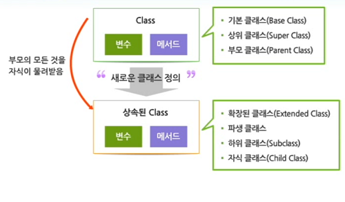
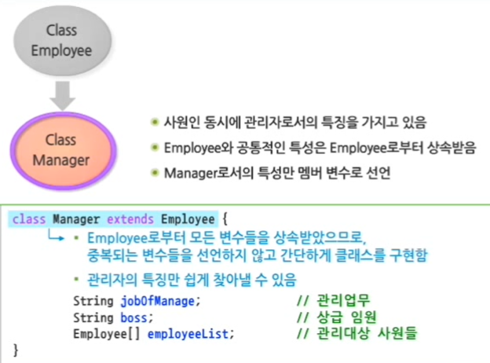
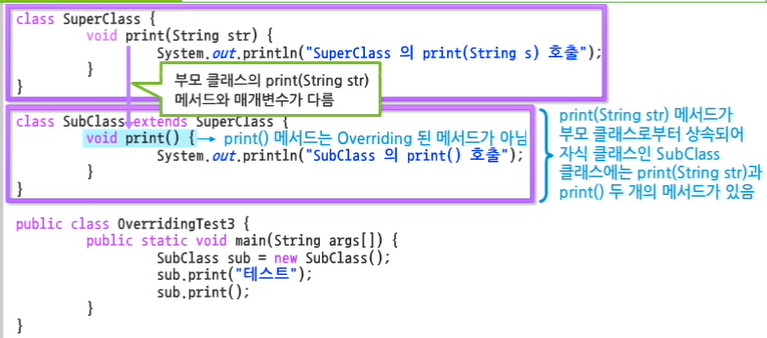

# 1. 상속

## 1. 상속의 개요

## 상속 (Inheritance)






### is a ~ 관계

부모 - 자식 클래스의 관계가 **일반화 - 특별화의 관계, is a 관계**에 있어야 한다.


### 단일 상속 (Single inheritance)

- 자바는 문법적으로 단일 상속만 허용한다.
- 하나의 클래스는 오직 하나의 부모 클래스만 상속할수 있다.
- 다중 상속을 허용하면 중복되는 변수와 메서드가 상속되는 문제가 발생한다.


## 2. 상속과 생성자

- 자식 클래스의 초기화가 이루어질 때, 부모 클래스의 생성자가 자동 호출되어 초기화를 수행한다.

- 이때, 자동 호출되는 부모 클래스의 생성자의 경우 별도로 호출되지 않는 경우 매개변수가 없는 기본 생성자를 호출한다.

```java
class SuperClass {
	int num1;
	
	// 부모 클래스에 기본 생성자가 없다면 에러가 발생한다.
	public SuperClass() {
		System.out.println("SuperClass 객체 생성");
		num1 = 100;
	}
}

class SubClass extends SuperClass {
	int num2;
	
	public SubClass() {
		System.out.println("SubClass 객체 생성");
		num1 = 10000;
	}
}

public class ConstructorTest {
	public static void main(String args[]) {
		SubClass sub = new SubClass();
		System.out.println(sub.num1);
		System.out.println(sub.num2);
	}
}

//	SuperClass 객체 생성
//	SubClass 객체 생성
//	10000
//	0
```


| `this()` 생성자 호출                                         | `super()` 생성자 호출                                        |
| ------------------------------------------------------------ | ------------------------------------------------------------ |
| - 클래스 안에서 **Overloading** 된 또 다른 생성자를 호출하기 위해 사용 | - **부모 클래스의 생성자를 명시적으로 호출**할 때 사용<br />- 부모 클래스의 생성자가 Overloading 되어 여러 개 존재하는 경우 특정 생성자를 호출하기 위해 사용 |

```java
class Shape {
	int x = 0;
	int y = 0;
	
	Shape() {
		this(0, 0);
		// 클래스 안에서 Overloading 된 또 다른 생성자를 호출하기 위해 사용
	}
	
	Shape(int x, int y) {
		this.x = x;
		this.y = y;
	}
}

class Circle extends Shape {
	int radius;
	
	Circle(int x, int y, int radius) {
		super(x, y); 
		
		// 1. 부모 클래스의 생성자가 Overloading 되어 
		// 여러 개 존재하는 경우 두 번째 생성자를 명시적으로 호출하기 위해 사용
		
		// 2. 주석 처리 시,
		// Shape 클래스의 기본 생성자가 호출되어서 x, ys는 0으로 초기화됨
		
		// 3. 반드시 생성자의 첫 번째 라인에 위치해야 함
		// - 부모 클래스의 생성자가 항상 자식 클래스의 생성자보다 먼저 수행되어야 함
		
		this.radius = radius;
	}
	
	public void draw() {
		System.out.println(x + ", " + y + " 좌표에 반지름이 " + radius + "인 원을 그린다.");
	}
}

public class SuperConstructorTest {
	public static void main(String[] args) {
		Circle c = new Circle(200, 500, 100);
		c.draw(); // 200, 500 좌표에 반지름이 100인 원을 그린다.
	}
}
```


## 2. 상속과 멤버

## 1. 상속과 변수

1. `private` 변수는 상속되지 않는다.

2. 부모 클래스 변수와 같은 이름의 변수를 선언하면 상속에서 제외된다.

```java
class Employee {
	String name;
	String grade;
	static String gender; // 클래스 변수로 선언함
}

class Manager extends Employee {
	char grade;
	static char gender; // 상속된 gender 대신 다시 선언
}

public class EmployeeTest {
	public static void main(String[] args) {
		Manager kim = new Manager();
		kim.name = "김재준";
		
		// kim.grade = 'A등급'; => error
		kim.grade = 'A';
		
		// Manager.gender = '남성'; // 클래스 변수는 클래스 이름으로 접근한다.
		Manager.gender = 'M';
		
		System.out.println("인사고과 : " + kim.grade); // 인사고과 : A
		System.out.println("성별 : " + kim.gender);    // 성별 : M
	}
}
```


### `super` 예약어

| `this` 예약어                                                | `super` 예약어                               |
| ------------------------------------------------------------ | -------------------------------------------- |
| - 생성된 객체 자기 자신에 대한 참조<br />- 멤버 변수와 메서드 매개변수에 대한 이름이 같을 경우 구분 | - 부모 객체에 접근할 수 있는 참조변수로 사용 |

```java
class Employee {
	String name;
	int deptNo;
	String grade;
}

class Manager extends Employee {
	String boss;
	char grade;
	
	void printGrade() {
		this.grade = 'A';		// Manager 자신이 가진 멤버 변수에 char 형 할당
		super.grade = "A등급";  // 부모인 Employee 객체의 변수에 문자열 할당
		
		System.out.println("자식 객체의 grade : " + this.grade);
		System.out.println("부모 객체의 grade : " + super.grade);
	}
}

public class EmployeeTest {
	public static void main(String[] args) {
		Manager kim = new Manager();
		kim.printGrade();
	}
}

//	자식 객체의 grade : A
//	부모 객체의 grade : A등급
```


## 2. 상속과 메서드

### 메서드 Overriding

- 자식 클래스가 부모 클래스의 메서드를 재정의히여 사용
  - 이때 메서드 이름, 매개 변수와 유형과 개수가 동일해야 함




## Overriding과 `Super` 예약어

메서드를 Overriding 하면서 부모 클래스의 메서드를 사용하고 싶을 때 사용한다.

```java
class Camera {
	String name;
	int sheets;
	
	public void takePicture() {
		System.out.println(name + "로 " + sheets + "번 사진을 찍는다.");
	}
}

class PolaroidCamera extends Camera {
	int batteryGage;
	
	public void takePicture() {
		super.takePicture(); // Camera 클래스의 takePicture() 메서드를 명시적으로 호출
		
		System.out.println(sheets + " 장의 사진을 프린트한다.");
		System.out.println("현재 배터리 : " + batteryGage + "%");
	}
}

public class OverridingTest {
	public static void main(String args[]) {
		PolaroidCamera camera = new PolaroidCamera();
		camera.name = "X-508";
		camera.sheets = 3;
		camera.batteryGage = 57;
		camera.takePicture();
	}
}

//	X-508로 3번 사진을 찍는다.
//	3 장의 사진을 프린트한다.
//	현재 배터리 : 57%
```


### Overriding과 `final` 예악어

`final` + 메서드 => 오버라이딩 금지

```java
class Printer {
	String name;
	int sheets;
	
	public void ready() {
		System.out.println(name + " 프린터를 예열한다.");
	}
	
	public final void printLogic() { // final => 메서드 오버라이딩 금지
		ready();
		for (int i = 0; i < 3; i++) {
			System.out.println(name + "로 " + sheets + "장 씩 출력한다.");
			
		}
		close();
	}
	
	public void close() {
		System.out.println(name + " 프린터를 종료한다.");
	}
}

class DotPrinter extends Printer {
	int batteryGate;	// 자식 클래스는 무조건 printLogic() 메서드가 상속되어 사용됨
}

public class OverridingTest2 {
	public static void main(String[] args) {
		DotPrinter printer = new DotPrinter();
		printer.name = "P-308";
		printer.sheets = 2;
		printer.batteryGate = 80;
		printer.printLogic();
	}
}
//	P-308 프린터를 예열한다.
//	P-308로 2장 씩 출력한다.
//	P-308로 2장 씩 출력한다.
//	P-308로 2장 씩 출력한다.
//	P-308 프린터를 종료한다.
```

