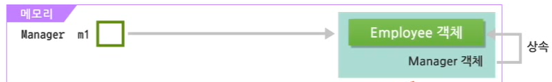

# 1. 추상 클래스와 내부 클래스

## 1. `abstract` 예약어

- 추상 메서드 : 메서드의 시그니쳐 (리턴타입, 메서드명, 매개변수만 정의)
  - 메서드의 기본적인 기능 유추 가능
- 추상 클래스 : 일반적으로 하나 이상의 추상 메서드 포함, (추상 메서드 없는 추상 클래스 가능)
  - 추상 메서드를 포함하면 반드시 추상 클래스로 선언되어야 함
  - **추상 클래스는 객체 생성을 할 수 없다.**


### 추상 클래스

- 추상 클래스로 객체를 생성하려면, 자식 클래스를 작성하고, 추상 메서드들을 Overriding 해야 함
  - 유지보수 편의성

```java
// TV 클래스를 추상 클래스로 정의한다.
abstract class TV {
	public abstract void powerOn();
	public abstract void powerOff();
	public abstract void volumeUp();
	public abstract void volumeDown();
}

// TV 클래스를 상속하여 S_TV 클래스 정의 => Overriding 필요
class S_TV extends TV {
	public void powerOn() {
		System.out.println("S_TV --- 전원을 켠다.");
	}
	public void powerOff() {
		System.out.println("S_TV --- 전원을 끈다.");
	}
	public void volumeUp() {
		System.out.println("S_TV --- 소리를 높인다.");
	}
	public void volumeDown() {
		System.out.println("S_TV --- 소리를 낮춘다.");
	}
}

//TV 클래스를 상속하여 L_TV 클래스 정의 => Overriding 필요
class L_TV extends TV {
	public void powerOn() {
		System.out.println("L_TV --- 전원을 켠다.");
	}
	public void powerOff() {
		System.out.println("L_TV --- 전원을 끈다.");
	}
	public void volumeUp() {
		System.out.println("L_TV --- 소리를 높인다.");
	}
	public void volumeDown() {
		System.out.println("L_TV --- 소리를 낮춘다.");
	}
}

public class AbstractTVUser {
	public static void main(String[] args) {
		S_TV tv = new S_TV();
//		L_TV tv = new L_TV();
		
		tv.powerOn();
		tv.powerOff();
		tv.volumeUp();
		tv.volumeDown();
		
//		S_TV --- 전원을 켠다.
//		S_TV --- 전원을 끈다.
//		S_TV --- 소리를 높인다.
//		S_TV --- 소리를 낮춘다.
	}
}
```


## 2. 내부 클래스

- 클래스는 데이터를 표현하기 위한 하나의 기본 단위로, 멤버 변수와 메서드로 구성된다.
- 클래스가 다른 클래스를 포함하는 경우, 내부에 포함된 클래스를 내부 클래스라고 한다.
  - 내부 클래스는 JDK 초기 버전부터 지원되었던 개념
  - 파일 크기의 최소화, 보안, 성능 향상, 이벤트 처리 등을 쉽게 하기 위하여 사용됨.

- 내부 클래스는 정의되는 위치에 따라 멤버 클래스와 지역 클래스로 나뉜다.

| 멤버 클래스                                                  | 지역 클래스                                                  |
| ------------------------------------------------------------ | ------------------------------------------------------------ |
| - 멤버 변수와 동일한 위치에 선언된 내부 클래스<br />- `static` 멤버, instance 멤버로 나뉜다.<br />- 동일한 클래스 뿐만 아니라 다른 클래스에서도 활용될 수 있다.<br />- 클래스의 멤버 변수와 성격이 비슷하다. | - **메서드 내에 클래스가 정의되어 있는 경우**<br />- 지역 클래스 (이름을 갖고 있음) 와 무명 클래스 (이름을 갖지 않음)으로 나뉜다.<br />- 활용 범위가 메서드 블록 내부로 제한되는 등 지역 변수와 성격이 비슷하다. |


### instance 멤버 내부 클래스

- instance 멤버 내부 클래스는 클래스의 멤버와 동일한 위치에서 선언되는 내부 클래스
- 멤버 변수, 메서드와 동일 위치에서 선언되었기 때문에 다른 외부의 클래스에서도 사용 가능하다.

```java
// 외부 클래스 (Top Level Class)
class Outside {
    // 내부 클래스 - 일반 멤버 변수와 동일 위치에 정의함
    public class Inside {
    }
}

public class InnerClassTest {
    public static void main(String args[]) {
        // 내부 클래스의 객체 생성을 위해 외부 클래스의 객체를 생성해야 함
        Outside outer = new Outside();
        Outside.Inside inner = outer.new Inside();
    }
}

// 컴파일
// Outside.class
// Outside$Inside.class
```


### static 멤버 내부 클래스

- 외부 클래스 객체를 생성하지 않고도 내부 클래스 객체를 생성할 수 있다.

```java
// 외부 클래스 (Top Level Class)
class Outside {
    // Static 내부 클래스 
    public static class StaticInside {
    }
}

public class InnerClassTest {
    public static void main(String args[]) {
        // static 내부 클래스 객체 생성 - 외부 클래스 객체 생성하지 않아도 생성됨
        Outside.StaticInner sinner = new Outside.StaticInner();
    }
}
```


### 이름이 있는 지역 내부 클래스

- 메서드 내부에서 정의된 클래스, 지역 변수와 동일한 범위를 가짐
- 클래스의 이름이 명시되는 클래스다.

```java
// 외부 클래스
class Animal {
 void performBehavior() {
     // 이름이 있는 지역 내부 클래스
     class Brain {
         // - 지역 내부 클래스를 정의함
         // - 지역 변수와 동일한 범위 -> 클래스가 선언된 메서드 블록 내에서만 사용 가능함
     }
 }
}

public class InnerClassTest {
 public static void main(String args[]) {
	 Animal outer = new Animal();
//	 Animal.Brain inner = outer.new Brain();
 }
}
// 컴파일
// Animal.class
// Animal$1Brain.class
```


### 이름이 없는 지역 내부 클래스

- 이름을 갖지 않는 내부 클래스
- `new` 예약어 뒤에 명시된 클래스가 기존의 클래스인 경우에는 자동적으로 이 클래스의 자식 클래스가 됨
- 이름이 없기 때문에 무명의 내부 클래스라고도 함
- 이름이 없는 지역 내부 클래스는 추상 클래스의 객체를 내부 클래스 형태로 생성할 때 자주 사용됨
- 추상 클래스는 추상 메서드를 포함하고 있기 때문에 객체를 생성할 수 없음
  - 추상 클래스를 상속한 클래스가 만들어져 객체를 생성해야 함
  - 간단하게 이름이 없는 지역 내부 클래스로 만들어 사용하는 것이 편리할 수 있음

```java
// 이름이 없는 지역 내부 클래스 구현

abstract class TV {
	public abstract void powerOn();
	public abstract void powerOff();
	public abstract void volumeUp();
	public abstract void volumeDown();
}

public class AnonymousTest {
	public static void watchTV(TV tv) {
		tv.powerOn();
		tv.volumeUp();
		tv.volumeDown();
		tv.powerOff();
	}
	
	public static void main(String[] args) {
		// - 이름이 없는 지역 내부 클래스 객체 생성
		// - TV라는 추상 클래스의 객체를 내부 클래스 형태로 생성했기 때문에,
		//  실제로는 TV 클래스를 상속한 내부 클래스가 만들어지게 된다.
		watchTV(new TV() {
			
			public void powerOn() {
				System.out.println("TV --- 전원을 켠다.");
			}
			public void powerOff() {
				System.out.println("TV --- 전원을 끈다.");
			}
			public void volumeUp() {
				System.out.println("TV --- 소리를 높인다.");
			}
			public void volumeDown() {
				System.out.println("TV --- 소리를 낮춘다.");
			}
		});
	}
}

//TV --- 전원을 켠다.
//TV --- 소리를 높인다.
//TV --- 소리를 낮춘다.
//TV --- 전원을 끈다.
```

```java
// 이름이 있는 독립된 클래스로 구현
abstract class TV {
	public abstract void powerOn();
	public abstract void powerOff();
	public abstract void volumeUp();
	public abstract void volumeDown();
}

class AnonymousClass extends TV {
	public void powerOn() {
		System.out.println("TV --- 전원을 켠다.");
	}
	public void powerOff() {
		System.out.println("TV --- 전원을 끈다.");
	}
	public void volumeUp() {
		System.out.println("TV --- 소리를 높인다.");
	}
	public void volumeDown() {
		System.out.println("TV --- 소리를 낮춘다.");
	}
}
```


# 2. 객체의 형변환

## 1. 형변환 개요

- 작은 데이터 타입 ----묵시적 형변환 (Promotion)-------> 큰 데이터 타입
  - 데이터 손실x 자동 캐스팅
- 작은 데이터 타입 <----명시적 형변환 (Demotion)------- 큰 데이터 타입
  - 데이터 손실 가능성 - 명시적 캐스팅

```java
// 묵시적 형변환 (자동)
int age = 25;
double avgAge = age; // 형변환 연산자 (double) 생략
					 // 25.0 

// 명시적 형변환
double avgAge = 24.56;
int age = (int)avgAge' // 24 출력
```


### 객체 형변환(Casting)의 개요

#### 객체 참조변수들 간의 대입 규칙

`leftObjRef = rightObjRef`

`부모 클래스 = 자식 클래스`

- 왼쪽 항과 오른쪽 항의 객체 유형이 서로 다른 경우 두 유형이 서로 상식 관계에 있음
- 왼쪽 객체가 상위 클래스 => 묵시적 형변환
- 자식 클래스 -> 부모 클래스 유형으로 할당하는 것 가능, 반대의 경우 명시적 형변환을 해야 함 
- 부모 클래스 -> 자식 클래스 형변환 시, 할당되는 인스턴스 유형에 따라 실행 오류 발생
  - `instanceof` 연산자 활용
    - 생성된 객체가 class와 관계있는 형(type)으로 만들어졌는지 확인
    - true 또는 false 값을 반환

```java
class Employee {
	
}

class Manager extends Employee {
	
}

public class InstanceOfTest {
	public static void main(String[] args) {
		Manager m = new Manager();
		Employee e = new Employee();
		System.out.println(m instanceof Manager);  // true
		System.out.println(m instanceof Employee); // true
		System.out.println(e instanceof Manager);  // false
	}
}
```


### 객체의 형변환

- 클래스의 형변환은 기본적으로 상속 관계가 아닌 클래스 사이에는 발생하지 않음
- 자식 클래스의 객체는 부모 타입의 참조 변수에 할당될 수 있음 (묵시적 형변환)

```java
class Employee {
	String name;
	int employeeNo;
	int departmentNo;
	
	public String getEmployeeInfo() { ... }
}

class Manager extends Employee {
	Employee[] employeeList; // 변수 추가
	public String getMangerInfo() { ... } // Overriding
}
```


#### 1. Employee 객체에 접근할 수 있는 경우

```java
Employee e1 = new Employee();
// e1 참조 변수는 타입이 Employee이고, Employee 객체를 참조함
```
  
- 타입과 생성된 객체가 모두 Employee

  - Employee 객체가 가지고 있는 변수나 메소드 모두 접근이 가능함


#### 2. Employee, Manager 객체에 모두 접근할 수 있는 묵시적 형변환인 경우

```java
Manager m1 = new Manager();
// m1 참조 변수는 타입이 Manager이고, Manager 객체를 참조함
```



- 타입과 생성된 객체가 모두 Manager임
  - Manager 객체의 멤버 필드와 메서드 모두 접근이 가능함 (**묵시적 형변환**)
- Manger 클래스는 Employee 클래스로부터 상속받았으므로, 객체 생성시 Manager 객체뿐만 아니라 Employee 객체도 생성 
- Manager 객체 생성 시 Employee가 가진 속성이 메모리에 로딩됨
- m1 참조변수를 통해 Employee, Manager 객체의 변수와 메서드를 모두 접근할 수 있음

#### 3. 생성된 객체와 참조하는 변수의 타입이 다른 경우

```java
Employee e2 = new Manager();
// e2 참조 변수는 타입이 Employee이고, Manager 객체를 참조함
```


- Manager는 Employee를 생성하기 때문에, Employee 객체가 가진 변수와 메서드 모두를 가지고 있는 객체다.
- 생성된 객체는 Manager이지만 참조 변수의 타입이 Employee => **접근 가능한 변수와 메소드는 Employee 객체로 제한됨**

#### 4. Employee, Manger 객체에 모두 접근할 수 있는 명시적 형변환인

```java
Manager m2 = (Manager)e2;
// m2 참조 변수는 타입이 Manager이고, Manager 객체를 참조함
```


- Employee 형의 e2 참조 변수를 Manager 형으로 명시적 형변환을 하고 있음
  - m2는 Manager 타입이므로 e2가 참조하고 있던 Manager 객체의 모든 멤버 필드와 메서드에 접근이 가능함

```java
// TV 클래스를 추상 클래스로 정의한다.
abstract class TV {
	public abstract void powerOn();
	public abstract void powerOff();
	public abstract void volumeUp();
	public abstract void volumeDown();
}

// TV 클래스를 상속하여 S_TV 클래스 정의 => Overriding 필요
class S_TV extends TV {
	public void powerOn() {
		System.out.println("S_TV --- 전원을 켠다.");
	}
	public void powerOff() {
		System.out.println("S_TV --- 전원을 끈다.");
	}
	public void volumeUp() {
		System.out.println("S_TV --- 소리를 높인다.");
	}
	public void volumeDown() {
		System.out.println("S_TV --- 소리를 낮춘다.");
	}
}

//TV 클래스를 상속하여 L_TV 클래스 정의 => Overriding 필요
class L_TV extends TV {
	public void powerOn() {
		System.out.println("L_TV --- 전원을 켠다.");
	}
	public void powerOff() {
		System.out.println("L_TV --- 전원을 끈다.");
	}
	public void volumeUp() {
		System.out.println("L_TV --- 소리를 높인다.");
	}
	public void volumeDown() {
		System.out.println("L_TV --- 소리를 낮춘다.");
	}
}

//TV 객체를 생성하여 리턴하는 TVFactory 클래스 작성
class TVFactory {
	// 모든 TV 객체들은 TV 타입으로 묵시적 형변환되어 리턴됨
	public TV getTV(String tvName) {
		if(tvName.equals("A사")) {
			return new S_TV(); 
		} else if(tvName.equals("B사")) {
			return new L_TV();
		}
		return null;
     }
}

public class AbstractTVUser {
	public static void main(String[] args) {
		TVFactory factory = new TVFactory(); 
		TV tv = factory.getTV(args[0]); 
		// 명령형 매개변수가 무엇인지에 따라 다른 TV 객체가 실행됨
		tv.powerOn();
		tv.volumeUp();
		tv.volumeDown();
		tv.powerOff();
	}
}
```


## 2. 형변환과 멤버

- 형변환에 참여한 서로 상속 관계에 있는 두 클래스 간에는 동일한 이름의 변수가 존재하거나 메서드가 Overriding 되어 있을 수 있음
- 생성된 객체 변수를 통해 멤버에 접근할 때 주의해야 함
- 객체 참조 변수가 변수나 메서드를 참조하는 경우, 참조 관계를 결정하는 시간이 다르기 때문에 차이가 발생

```java
class Parent {
	int num = 10;
	
	void printNum() {
		System.out.println(num);
	}
}

class Child extends Parent {
	int num = 20;
	void printNum() {
		System.out.println(num);
	}
}

public class ObjectCastTest {
	public static void main(String args[]) {
		// Parent 클래스의 객체 생성 및 요소 접근
		Parent p = new Parent();
		p.printNum();				// 10
		System.out.println(p.num);	// 10
		
		// Child 클래스의 객체 생성 및 요소 접근
		Child c = new Child();
		c.printNum();				// 20
		System.out.println(c.num);	// 20
		
		// 묵시적 형변환을 하는 경우
		Parent p2 = new Child(); 	// Child 객체 생성, Parent 타입 변수에 할당
		p2.printNum();				// 20 - Child 객체에서 Overriding된 메서드 호출
									// 2. 메서드 호출은 할당되는 인스턴스에 의해 결정됨
		
		System.out.println(p2.num);	// 10 
									// 1.변수에 대한 접근은 객체의 유형에 의해 결정됨
	}
}
```

