# 1. 인터페이스와 다형성

## 1. 인터페이스

### 추상 클래스와 인터페이스

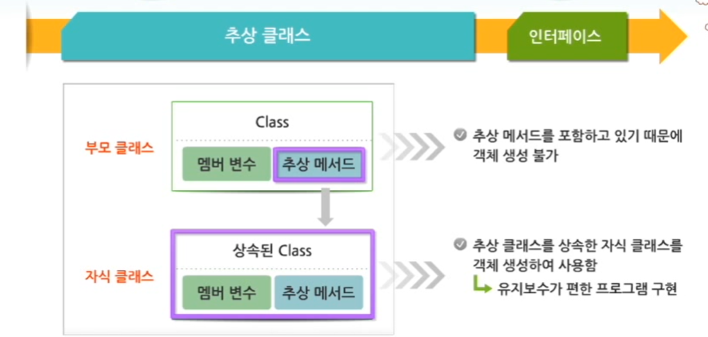

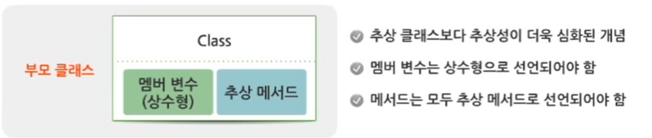

인터페이스는 상수와 추상 메서드 외에 다른 멤버를 갖지 못하게 한다.


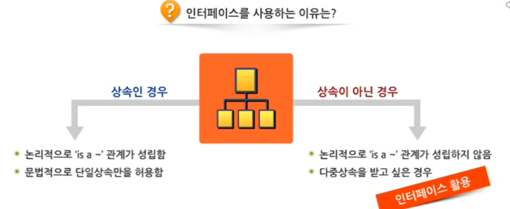

### 인터페이스를 사용하는 이유

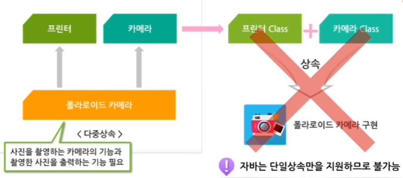

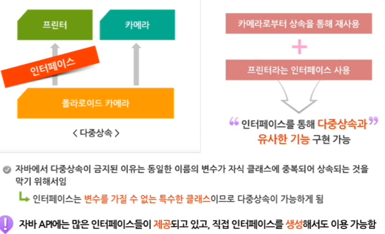


```java
public interface 인터페이스명 [extends 부모인터페이스며, ...] {
    // 상수 
    // - final 예약어로 멤버 변수를 선언해야 함
    // - 인터페이스는 객체를 생성할 수 없으므로, 상수는 static 예약어로 선언해야 함
    // 추상 메서드
    // 그러나 static final, abstract 생략 가능
}
```


## 2. 인터페이스의 활용

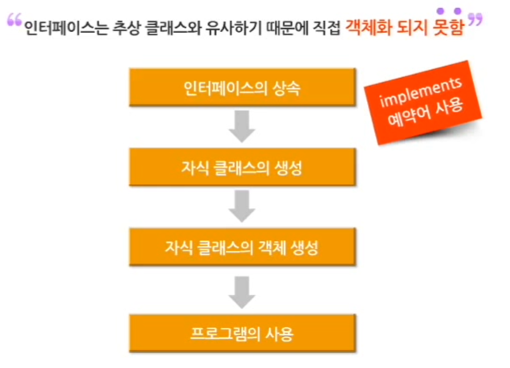

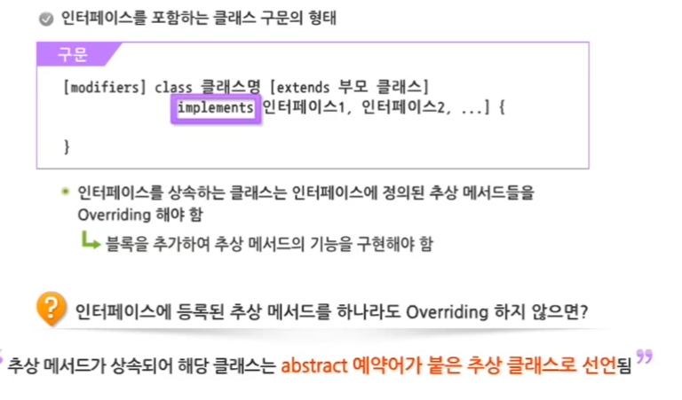

```java
interface Drawable {
	public int PLAIN_PEN = 1;
	public int BOLD_PEN = 2;
	public int ITALIC_PEN = 3;
	public void draw();				// 추상 메서드
	public void move(int x, int y); // 추상 메서드
}

class Shape {
	int x = 0;
	int y = 0;
	
	Shape(int x, int y) {
		this.x = x;
		this.y = y;
	}
}

class Circle extends Shape implements Drawable {
	int radius;
	
	Circle(int x, int y, int radius) {
		super(x, y);
		this.radius = radius;
	}
	
	public void draw() {
		// Overriding
		System.out.println("(" + x + ", " + y + ") radius = " + radius);
	}
	
	public void move(int x, int y) {
		// Overriding
		System.out.println("(" + (this.x + x) + ", " + (this.y + y) + ") radius = " + radius);
	}
}

class Rectangle extends Shape implements Drawable {
	int width;
	int height;
	
	Rectangle(int x, int y, int width, int height) {
		super(x, y);
		this.width = width;
		
		this.height = height;
	}
	
	public void draw() {
		// Overriding
		System.out.println("(" + x + ", " + y + ") "
				+ "width = " + width + ", height = " + height);
	}
	
	public void move(int x, int y) {
		// Overriding
		System.out.println("(" + (this.x + x) + ", " + (this.y + y) + ") "
				+ "width = " + width + ", height = " + height);
	}
}

public class InterfaceTest1 {
	public static void main(String[] args) {
		Circle c = new Circle(10, 10, 100);
		c.draw();
		c.move(5, 5);
		
		Rectangle r = new Rectangle(20, 20, 50, 50);
		r.draw();
		r.move(5, 10);
	}
}
//	(10, 10) radius = 100
//	(15, 15) radius = 100
//	(20, 20) width = 50, height = 50
//	(25, 30) width = 50, height = 50
```


### 형변환

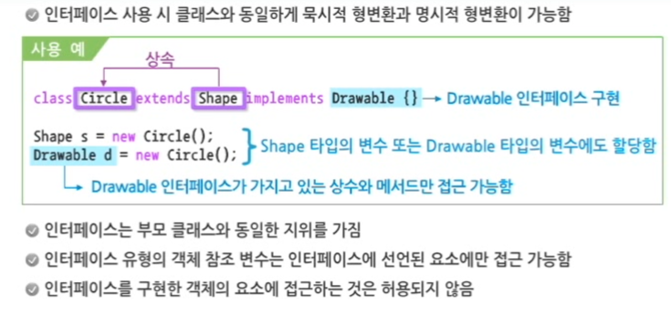

```java
public class InterfaceTest1 {
	public static void main(String[] args) {
		// Circle c = new Circle(10, 10, 100);
		Drawble d = new Circle(10, 10, 100);
		// 자식 클래스 객체는 부모 타입 참조 변수에 할당 가능 / 인터페이스도
		d.draw();
		d.move(5, 5);
		
		// Rectangle r = new Rectangle(20, 20, 50, 50);
		d = new Rectangle(20, 20, 50, 50);
		d.draw();
		d.move(5, 10);
	}
}
```


### 인터페이스의 상속

인터페이스도 extends 예약어로 상속 가능

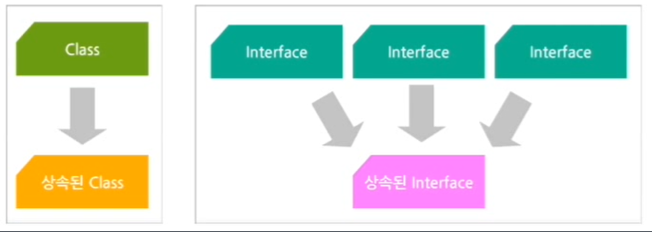

```java
interface Paintable {
	public void paint();
}

interface Drawable {
	public int PLAIN_PEN = 1;
	public int BOLD_PEN = 2;
	public int ITALIC_PEN = 3;
	public void draw();				// 추상 메서드
	public void move(int x, int y); // 추상 메서드
}

interface Printable extends Paintable, Drawable {
	public void print();
	// Paintable, Drawable로부터 
	// 모든 상수와 추상 메서드를 상속하고 있는 print() 추상 메서드 추가
}

class Shape {
	int x = 0;
	int y = 0;
	
	Shape(int x, int y) {
		this.x = x;
		this.y = y;
	}
}

class Circle implements Printable {
	public void draw() {
		System.out.println("원을 그립니다.");
	}
	
	public void move(int x, int y) {
		System.out.println("원을 이동시킵니다. : (" + x + "," + y + ")");
	}
	
	public void paint() {
		System.out.println("원을 색칠합니다.");
	}
	
	public void print() {
		System.out.println("원을 출력합니다.");
	}
}


public class InterfaceTest2 {
	public static void main(String[] args) {
		Circle c = new Circle();
		c.draw();
		c.move(5, 5);
		c.paint();
		c.print();
	}
}
//	원을 그립니다.
//	원을 이동시킵니다. : (5,5)
//	원을 색칠합니다.
//	원을 출력합니다.
```


# 2. 객체지향 언어의 주요 개념

## 1. 패키지 개요

### 자바 API 패키지

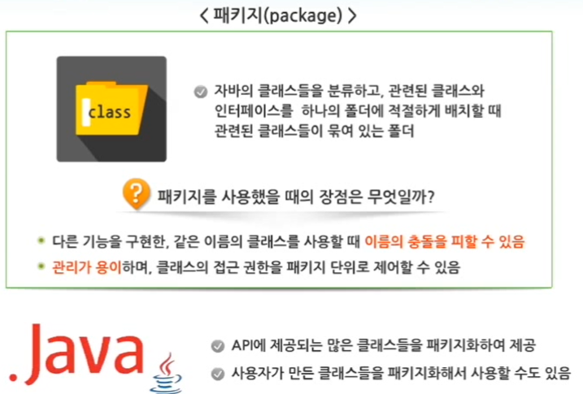


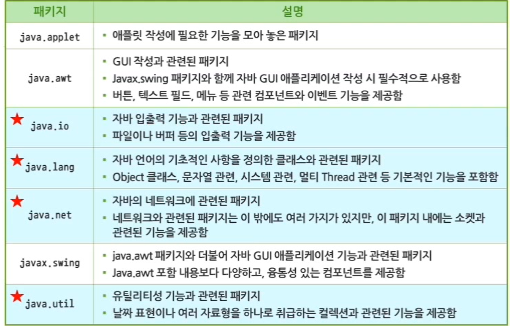


### `import` 예약어

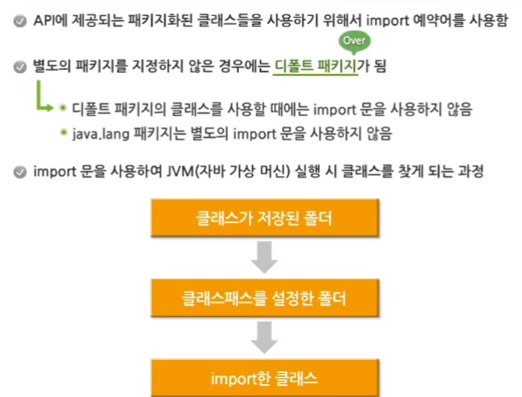


#### 다른 패키지의 클래스 사용하기

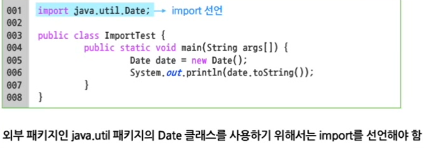

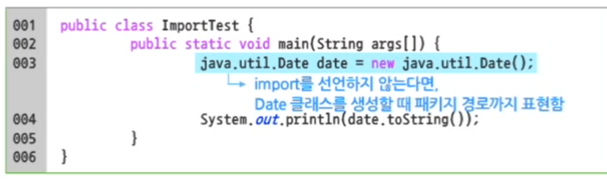

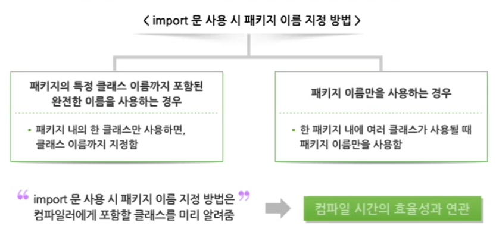

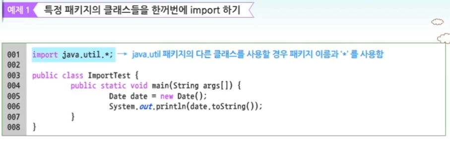


#### 여러 패키지에 동일한 이름의 클래스를 import 하는 경우

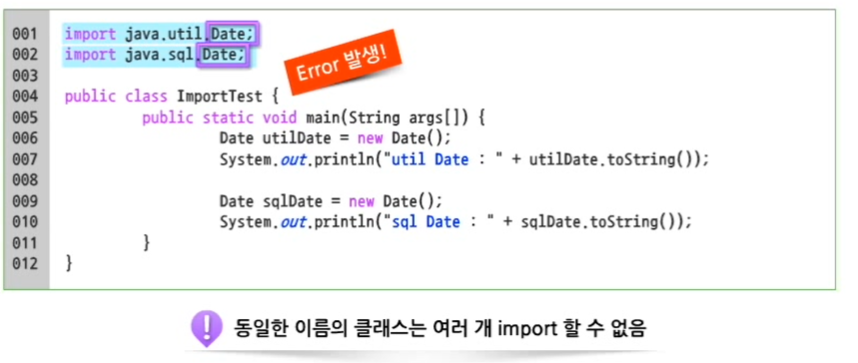


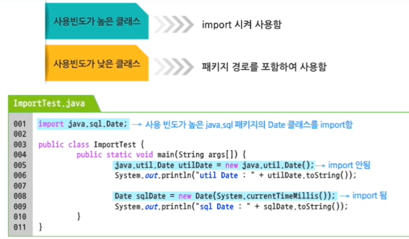


### 2. 사용자 정의 패키지

#### package의 개념
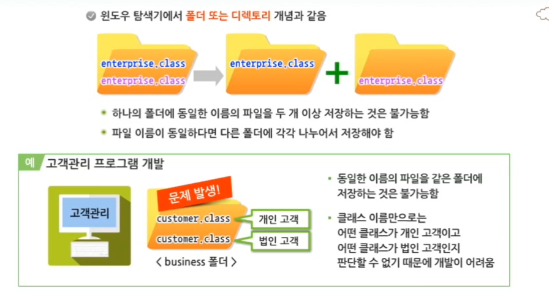
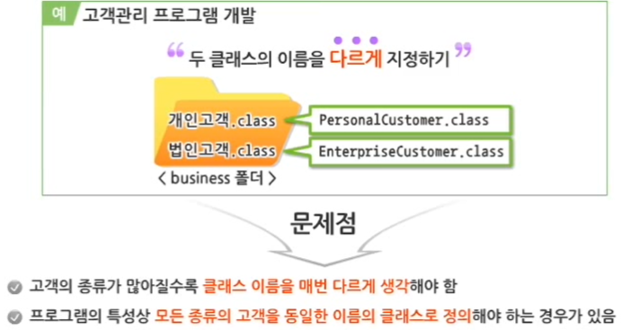

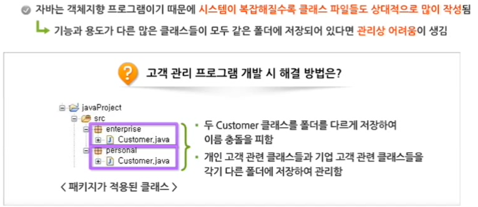


#### package 예약어

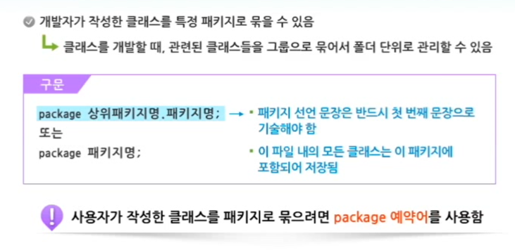


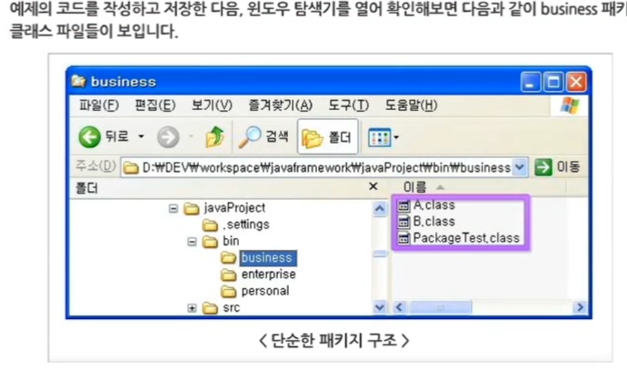


#### 사용자 정의 패키지와 `import`

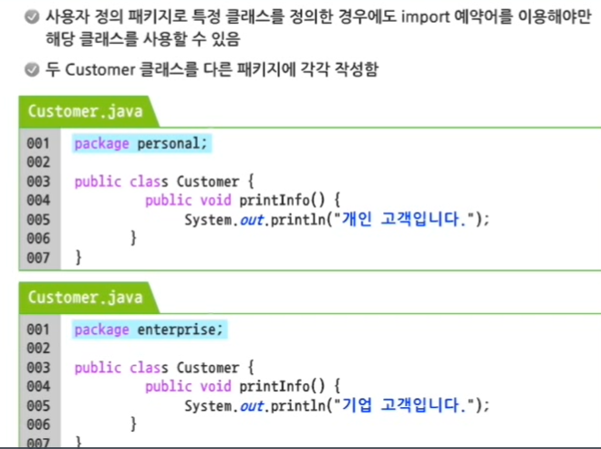


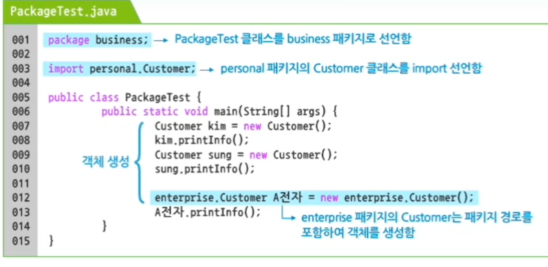

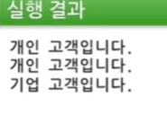

## 2. 커스텀 라이브러리 사용

#### 커스텀 라이브러리 사용하기

자바는 프로그램 구현에 필요한 중요 클래스들을 API 형태로 JVM에 포함


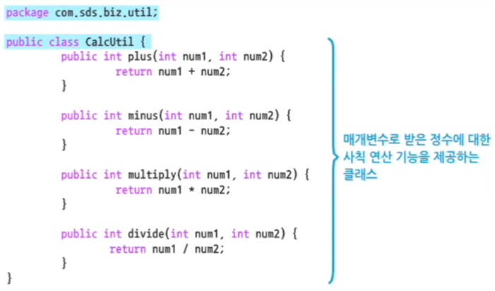

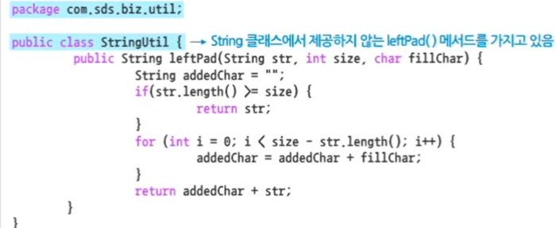

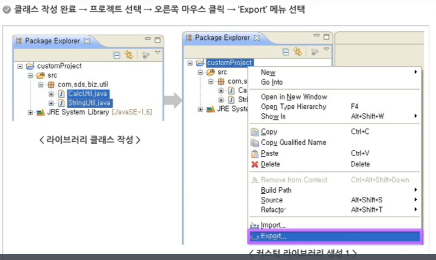


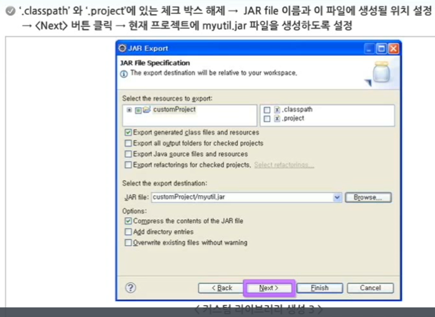


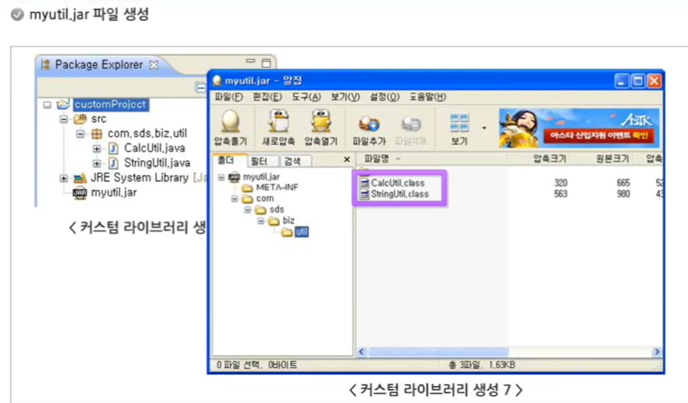


### 3. 커스텀 라이브러리 사용

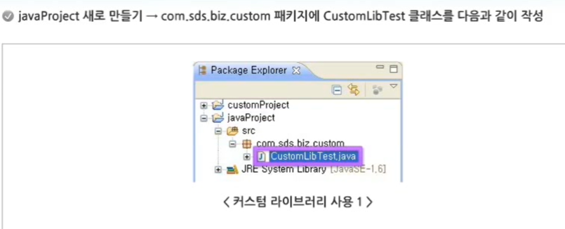

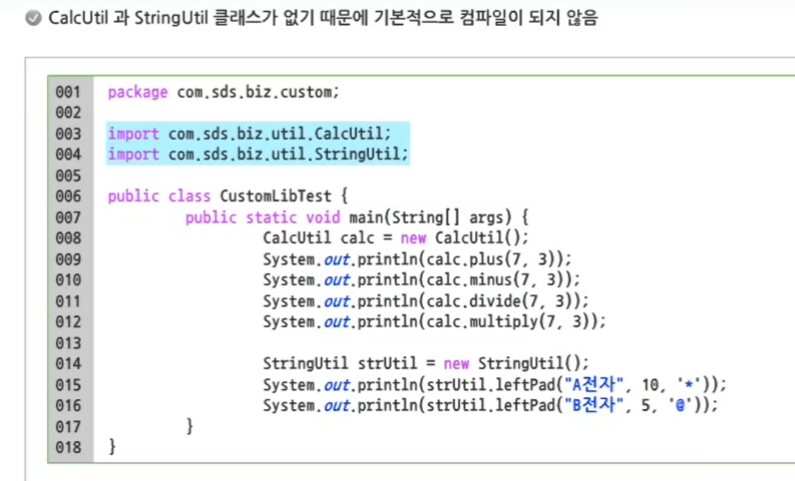

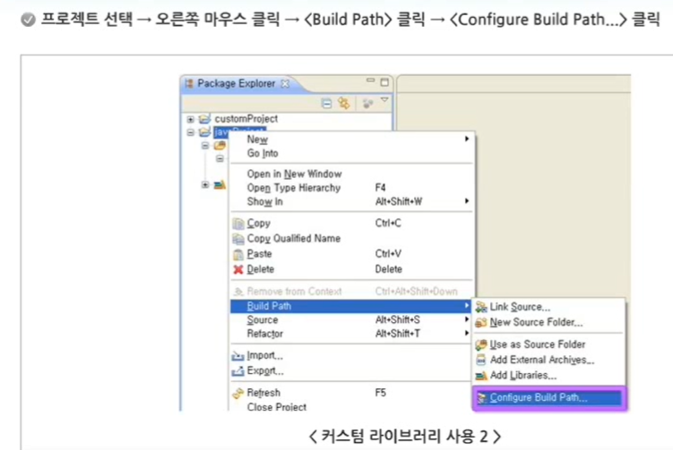

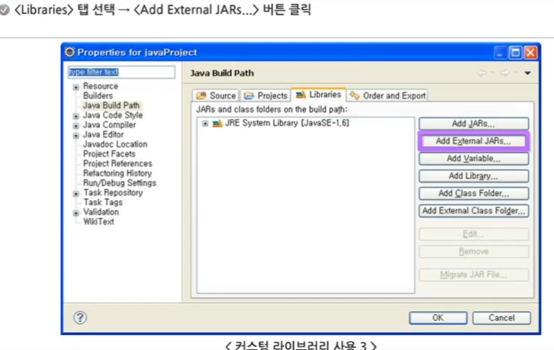

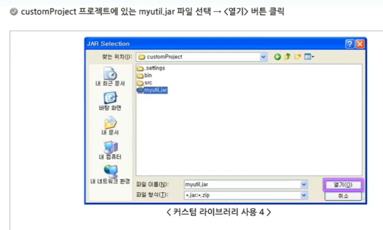

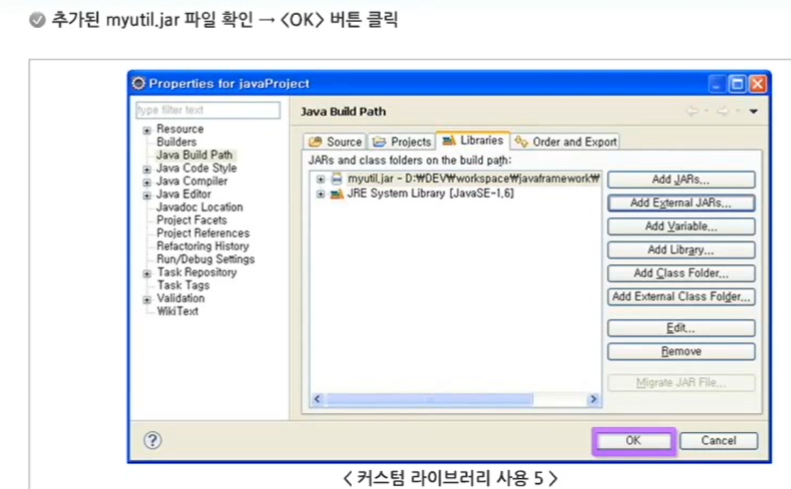

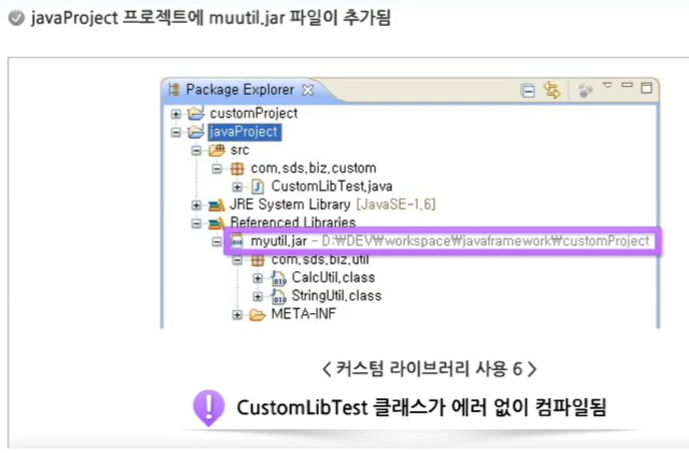