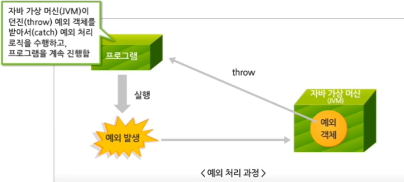
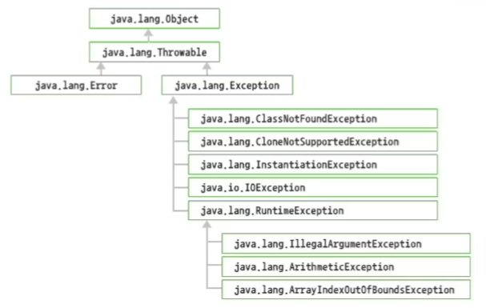
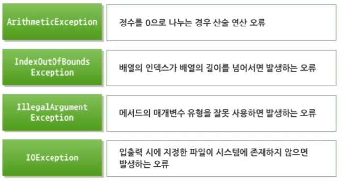

# 1. 예외 처리

## 1. 예외의 개념

오류

1. Error : 프로그램적으로 처리할 수 없기 때문에 에러 발생 시 프로그램이 중단됨
   - 네트워크 작업 처리 시 랜선이 끊어짐 전원 공급 중단
2. Exeption  : 프로그래머가 예측하고 프로그램적으로 처리할 수 있는 오류
   - 정수를 0으로 나누는 경우
   - 배열의 인덱스가 음수 값을 가지는 경우
   - 배열의 인덱스가 배열의 길이를 넘어서는 경우
   - 부적절한 형변환이 발생하는 경우
   - 입출력 시 Interrupt 발생
   - 입출력 파일이 존재하지 않을 경우


### 예외 Exeption

- 자바는 예외도 객체로 처리한다.
- 발생 가능성 있는 모든 예외 상황을 미리 예측하여 예외 클래스로 제공한다.



- 프로그램이 예외 처리 로직을 구현하지 않은 경우에는 **기본 예외 처리 핸들러**가, 에러 메시지를 화면에 출력하고 실행을 중지시킨다.

```java
public class ExeptionHandlerTest {
	public static void main(String[] args) {
		System.out.println("program starts...");
		int num1 = 9;
		int num2 = 0;
		System.out.println("나누기 결과 : " + (num1 / num2));
		System.out.println("program end...");
	}
}
//program starts...
//Exception in thread "main" java.lang.ArithmeticException: / by zero
//	at firstproject.ExeptionHandlerTest.main(ExeptionHandlerTest.java:8)
```


### 예외 클래스

- 모든 예외는 `java.lang.Throwable` 클래스의 자식 클래스인 `java.lang.Exception`클래스의 자식 클래스로 만들어짐
- `RuntimeException`의 자식 클래스들은, 예외 처리를 포함하지 않아 컴파일 되는 예외 클래스
  - 실행 시에 발새하는 컴파일러가 컴파일을 해준다.






## 2. 예외 처리

### 자바의 예외 처리 방식

1. 예외가 발생한 메서드 내에서 **직접 처리**
   - `try~catch` 구문
   - 다중 `catch` 블록
   - 상속을 이용한 예외 처리
   - `finally` 블록
2. 해당 메서드를 호출한 곳으로 **예외 처리를 넘기는 방식**
   - `throws` 예약어


### `try-catch` 구문

1. 지정한 타입의 예외 객체 발생
2. try 블록의 나머지 문장들은 수행되지 않음
3. 자바 가상 머신 (JVM)은 발생한 예외 객체를 발생시킴
4. 발생하는 예외 객체에 해당하는 catch 블록을 수행함

```java
try {
    // - 예외 발생 가능이 이쓴 코드
    // - try 블록은 최소한 하나의 catch 블록이 있어야 한다.
} catch (예외 타입 매개변수명) {
    // catch 블록의 매개변수는 예외 객체가 발생했을 때 참조하는 변수명으로, 
    // 반드시 java.lang.Throwable 클래스의 하위 클래스 타입으로 선언되어야 한다.
}
```


### 다중 `catch` 블록

여러 개의 예외 처리 가능


### 상속을 이용한 예외 처리


### `finally` 블록

- `finally` 블록의 내용은 예외 발생 유무나 예외 catch 유무와 상관 없이 무조건 수행됨
- 데이터베이스 연동 로직, 파일 입출력 로직을 수행한 후에 반드시 수행되어야 할 로직이 있는 경우에 사용함

```java
public class ExceptionTest {
	public static void main(String[] args) {
		System.out.println("program starts...");
		try {		
			int num1 = Integer.parseInt(args[0]);
			int num2 = Integer.parseInt(args[1]);
			System.out.println("나누기 결과 : " + (num1 / num2));	
		} catch (ArithmeticException e) {
			System.out.println("정수를 0으로 나눌 수는 없습니다.");
		} catch (ArrayIndexOutOfBoundsException e) {
			System.out.println("명령형 매개변수 2개가 필요합니다.");
		} catch (NumberFormatException e) {
			System.out.println("매개변수는 정수만 허용됩니다.");
		} catch (Exception e) { // 맨 마지막에 위치해야 함
			System.out.println("프로그램 수행 중 문제 발생!");
		}
		finally {	
			System.out.println("무조건 수행되는 로직 입니다.");
		}
		System.out.println("program end...");
	}
}
```


### `throws` 예약어

예외가 발생한 메서드를 호출한 지점으로 예외를 전달하여 처리하는 방법

```java
public class ThrowTest {
	public static void main(String[] args) {
		System.out.println("program start...");
		int[] scoreList = {45, 77, 59, 88, 100};
		double avgScore = getAvgScore(scoreList);
		System.out.println("평균 점수 : " + avgScore);
		System.out.println("program end...");
	}
	
	private static double getAvgScore(int[] scoreList) 
					throws ArrayIndexOutOfBoundsException { // throw 구문 생략 가능
		int sum = 0;
		for (int i = 0; i <= scoreList.length; i++) {
			sum = sum + scoreList[i];
		}
		return (double)sum/scoreList.length;
	}
}
//	Exception in thread "main" java.lang.ArrayIndexOutOfBoundsException: Index 5 out of bounds for length 5
//	at firstproject.ThrowTest.getAvgScore(ThrowTest.java:16)
//	at firstproject.ThrowTest.main(ThrowTest.java:7)

// 즉, getAvgScore()에서 발생한 예외가 main 메서드까지 전달된 것이다.
```

`throws`를 사용하여 예외 처리를 다른 메서드로 전달할 때, 발생된 예외 객체가 `RuntimeException`의 자식 클래스인 경우 => 명시적으로 `throws`문을 사용하지 않아도 자동으로 `throws` 됨


```java
// throws로 던져진 예외 처리하기
public class ThrowTest {
	public static void main(String[] args) {
		System.out.println("program start...");
		int[] scoreList = {45, 77, 59, 88, 100};
		try {
			double avgScore = getAvgScore(scoreList);
			System.out.println("평균 점수 : " + avgScore);
		} catch (ArrayIndexOutOfBoundsException e) {
			System.out.println("평균 구할 때 문제 발생!");
		}
		System.out.println("program end...");
	}
	
	private static double getAvgScore(int[] scoreList) 
					throws ArrayIndexOutOfBoundsException { // throw 구문 생략 가능
		int sum = 0;
		// 배열의 길이가 5이면 실제 배열 객체의 인덱스는 4까지만 존재함
		for (int i = 0; i <= scoreList.length; i++) {
			sum = sum + scoreList[i];
		}
		return (double)sum/scoreList.length;
	}
}
//	program start...
//	평균 구할 때 문제 발생!
//	program end...
```


```java
// throws를 통한 예외 처리

class A {
	public void methodA() throws ArithmeticException {
		System.out.println("나누기 결과 : " + (9 / 0));
	}
}
class B {
	public void methodB() throws NumberFormatException {
		String number = "1234";
		System.out.println("변경된 숫자 : " + Integer.parseInt(number));
	}
}
class C {
	public void methodC() throws ArithmeticException, NumberFormatException {
		A a = new A();
		a.methodA();
		B b = new B();
		b.methodB();
	}
}

public class ThrowTest {
	public static void main(String[] args) {
		try {
			C c = new C();
			c.methodC();
		} catch (ArithmeticException e) {
			System.out.println("정수를 0으로 나눌 수는 없습니다.");
		} catch (NumberFormatException e) {
			System.out.println("매개변수는 정수만 허용됩니다.");
		}
	}
}
```


# 2. 사용자 정의 예외

## 1. 사용자 정의 예외 처리

- 자바 API에서 제공하지 않는 예외 클래스를 개발자가 직접 정의하여 사용한다.
- 모든 예외 클래스의 최상위 클래스은 `java.lang.Exception` 클래스를 상속받아 정의한다.


### `throw` 예약어

사용자가 강제적으로 예외를 발생시킴 프로그램에서 직접 생성

```java
throw new 예외클래스명();
```

```java
class Account {
	String name;
	int currentMoney;
	
	public Account(String name, int currentMoney) {
		this.name = name;
		this.currentMoney = currentMoney;
	}
	public void withdraw(int money) {
		try {
			if (currentMoney < money) {
				throw new IllegalArgumentException();
			}
			currentMoney = currentMoney - money;
		} catch (IllegalArgumentException e) {
			System.out.println("잔액이 부족합니다.");
		}
	}
	public String toString() {
		return "Account [name=" + name + ", currentMoney=" + currentMoney + "]";
	}
}

public class CustomExceptionTest {
	public static void main(String[] args) {
		Account kimAccount = new Account("김재준", 100);
		kimAccount.withdraw(150); // 보유 금액 < 인출하려는 금액
		System.out.println(kimAccount.toString());
	}
}
//	잔액이 부족합니다.
//	Account [name=김재준, currentMoney=100]
```


```java
// try-catch로 직접 예외처리를 하지 않고
// throws를 이용하여 예외가 발생한 메서드를 호출한 다른 메서드로 예외 처리를 넘김

class BadBankingException extends Exception{
    // RuntimeException을 상속하도록 구현하면 
	public BadBankingException(String s) {
		super(s);
	}
}

class Account{
	String name;
	int current;
	Account(String name, int current){
		this.name=name;
		this.current=current;
	}
	
	void withdraw(int money) throws BadBankingException {
        			// 명시적인 throws를 사용하지 않아도 됨
		if(money>current) 
			throw new BadBankingException("잔액이 부족합니다.");
		else
			current=current-money;
	}
}

public class CustomExceptionTest {
	public static void main(String[] args) {
		Account kimAccount = new Account("김미진", 100);
		try {
			kimAccount.withdraw(150);
		}catch(BadBankingException e) {
			System.out.println(e.getMessage());
		}
	}
}
//	잔액이 부족합니다.
```