# 1. java.lang 패키지

## 1. java.lang 패키지

가장 기본이 되는 필수 클래스와 인터페이스들이 포함된 패키지며 import 없이 사용 가능하다.

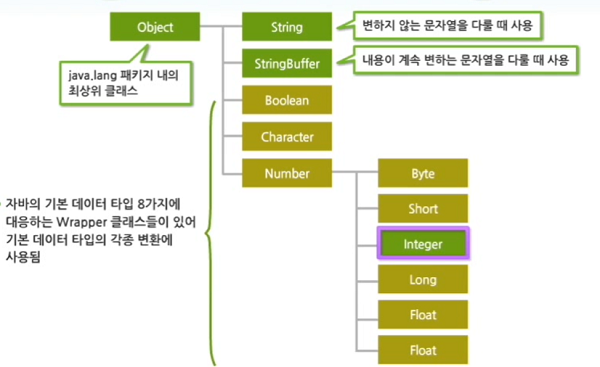

## 2. Object 클래스

- java.lang.Object 클래스
- 자바 API에 정의된 모든 클래스의 최상위 클래스며, Object 클래스들의 상속은 소스 상에 명시하지 않아도 자동으로 이루어짐
  - 자바의 모든 클래스는 부모인 Object 클래스의 모든 변수와 메소드를 상속받아 사용 가능하다.

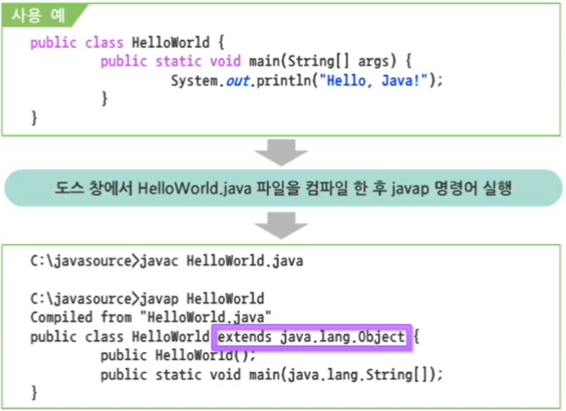

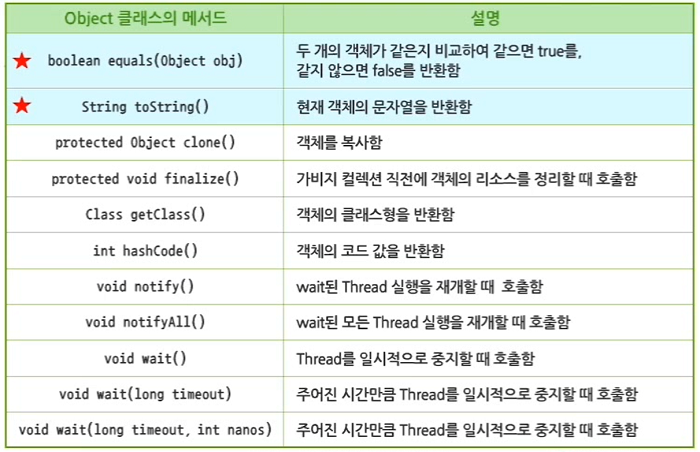

### `equals()` 메서드

1. `==` 연산자는 자바에서 값을 비교하기 위해 사용하는 연산자

   1. 기본형 : 변수가 값 자체를 가지기 때문에 `==` 연산자로 비교 가능
   2. 참조형 : 객체의 내용을 비교하는 것이 아니라 주소 값이 같은지 여부를 비교함
      - 메모리의 다른 위치에 생성된 객체의 주소 값이 객체 참조 변수에 저장되기 때문

   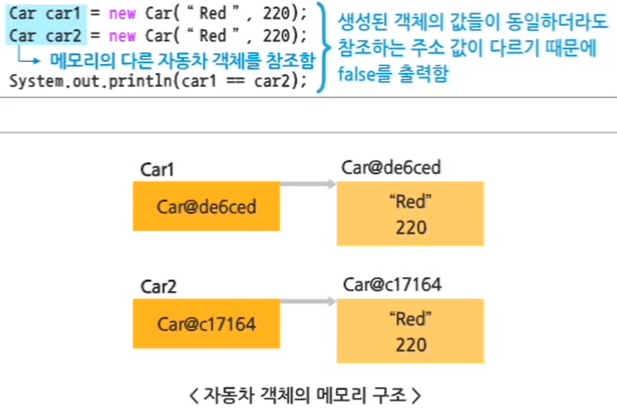

   2. `equals() `메서드는 비교 대상이 되는 두 개의 주소 값을 비교하는 것이 아니라 객체의 내용을 비교함
      - 그러나 `equals()` 메서드는 객체의 주소 값을 비교하는 `==` 연산자와 동일하게 동작함

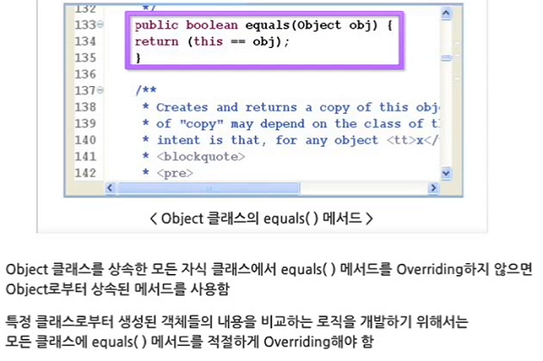

```java
class Car {
	String name;
	int speed;
	
	public Car(String name, int speed) {
		this.name = name;
		this.speed = speed;
	}
	
	public boolean equals(Object obj) {
		Car other = (Car) obj;
		if(name != other.name) {
			return false;
		}
		if (speed != other.speed) {
			return false;
		}
		return true;
	} 
}

public class EqualsTest {
	public static void main(String[] args) {
		Car car1 = new Car("Red", 220);
		Car car2 = new Car("Red", 220);

		if (car1 == car2) {
			System.out.println("car1, car2는 주소 값이 같다.");
		} 
		if (car1.equals(car2)) {
			System.out.println("car1, car2는 객체의 내용이 같다.");
		}
	}
}
//	car1, car2는 객체의 내용이 같다.	
```

### 

### `toString()` 메서드

- 수시로 변하는 객체의 변수 값들을 화면에 출력할 때 사용
- 객체의 클래스 타입 이름과 객체의 코드 값을 16진수 문자열로 리턴하도록 구현함
- 적절하게 Overriding 하여 사용한다.
- System.out.print() 메서드 호출 시 자동으로 호출되기 때문에 생략 가능함

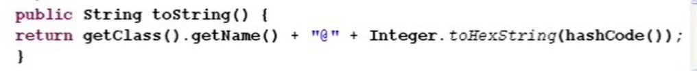

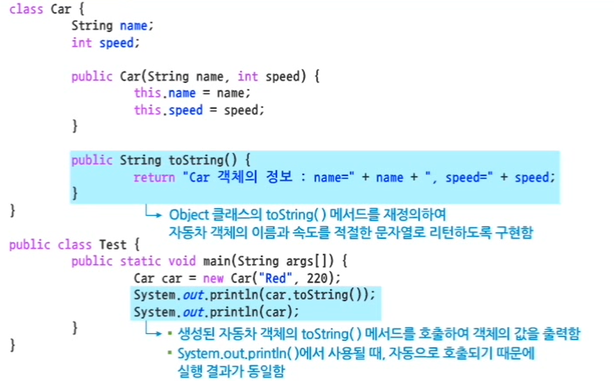

### equals(), toString() 자동 생성

- 두 메서드는 자식 클래스에서 재정의하여 사용할 수 있으며 자동 생성 기능을 제공함

- Alt + Shift + S  -> Generate hashCode() and equals() 메뉴를 선택함

  - 자동으로 생성된 메서드에서 hashCode()를 제거하여 equals() 메서드만 남긴다.

- Alt + Shift + S  -> Generate toString() 메뉴를 선택함

  

## 3. Wrapper 클래스

- 자바에서는 8가지 기본 데이터 타입을 객체로 사용할 수 있도록 지원한다.
- 각각의  데이터 타입과 관련된 Wrapper 클래스를 제공한다.
  -  사용자의 문자열 입력을 다양한 기본 데88이터 타입으로 변환하는 편리한 메서드들을 제공한다.
  - Wrapper 클래스 객체는 한 번 생성되면 **그 값이 변할 수 없다.**

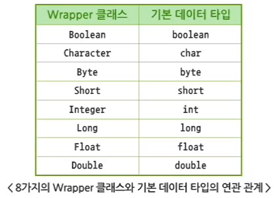

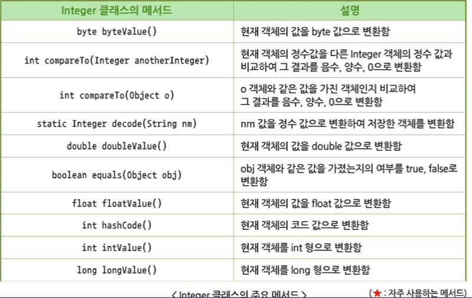

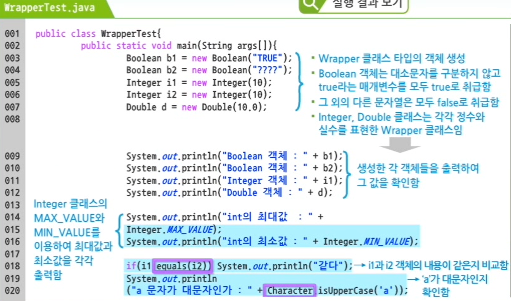

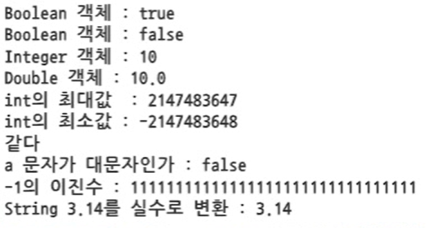

# 2. 객체지향 언어의 주요 개념

## 1. String 클래스

- String 객체는 여러 개의 문자들로 이루어진 문자 배열 형태가 생성되고 인덱스는 0부터 시작함

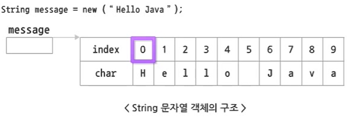

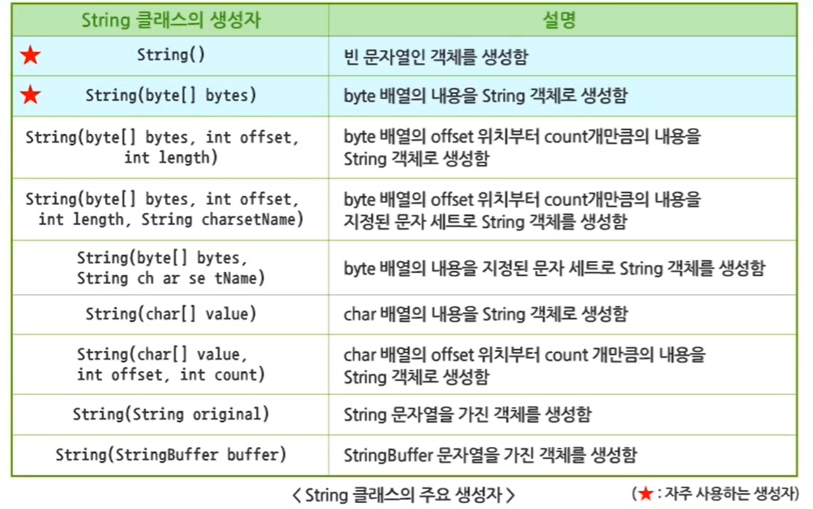

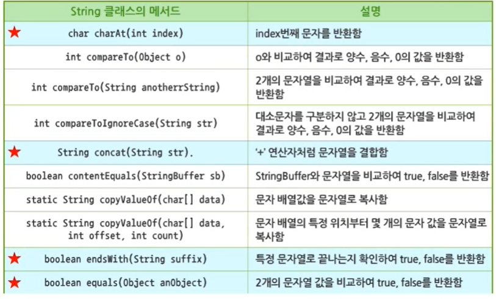


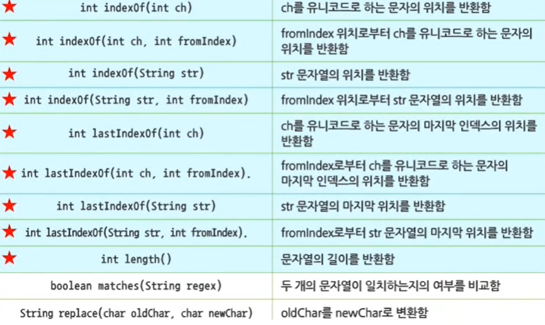


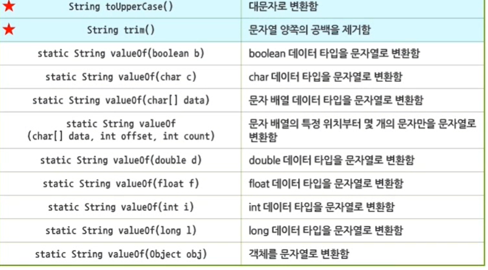


### String 클래스의 특징

- String 객체는 한 번 생성되면 문자열 내용이 변경되지 않는다.
- String 클래스가 제공하는 모든 메서드는 실행 결과를 또 다른 문자열 객체로 리턴한다.
- 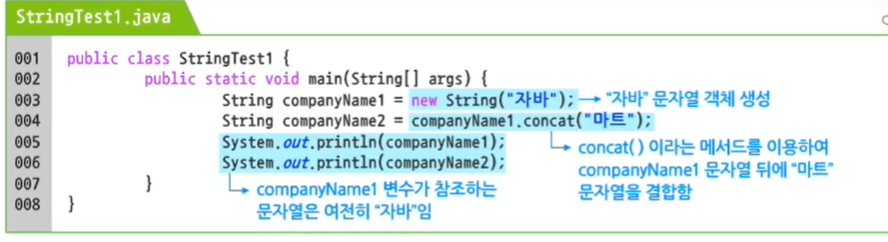
- String 클래스는 두 가지 형태의 객체 생성 방법을 제공합니다.

```java
String name1 = new String("자바전자");
String name2 = "자바마트";
// new 연산자를 사용하지 않고 문자열을 저장한 변수는 컴파일 시점에서 생성되어 메모리를 할당받는다.
// 동일한 문자열을 가진 String이라면 같은 문자열이 저장된 주소 값을 재사용한다.


// String 클래스의 객체 생성은 배열 객체 생성과 비슷하다.
int[] scoreList = new int[3];
scoreList[0] = 50;
scoreList[1] = 90;
scoreList[2] = 70;

// 또는
int scoreList = {50, 90, 70};
```

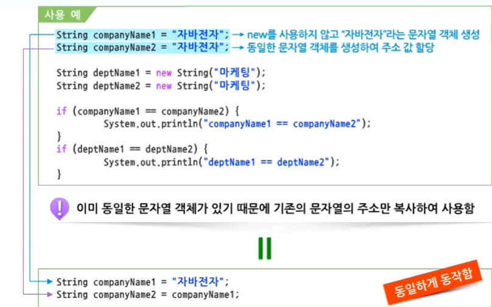

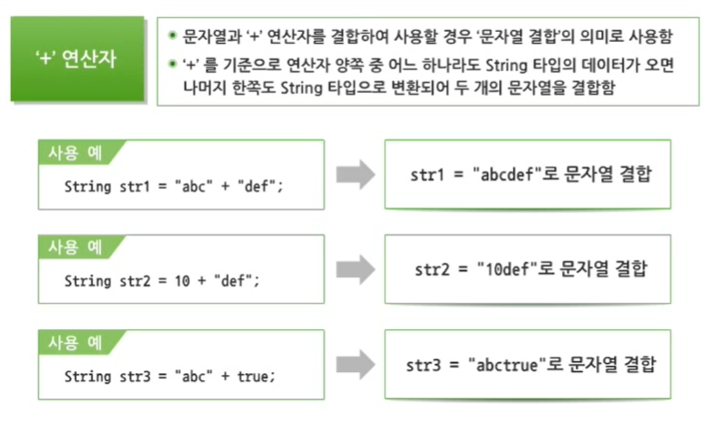

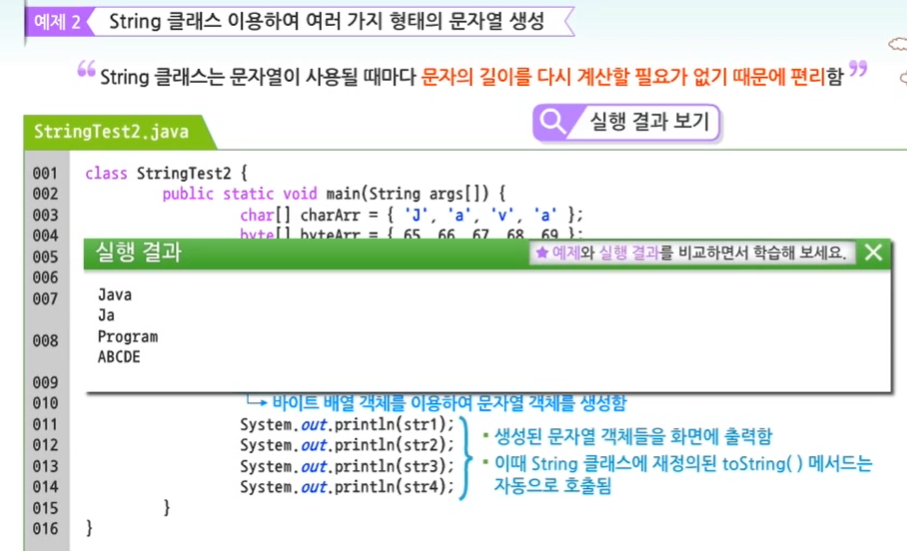

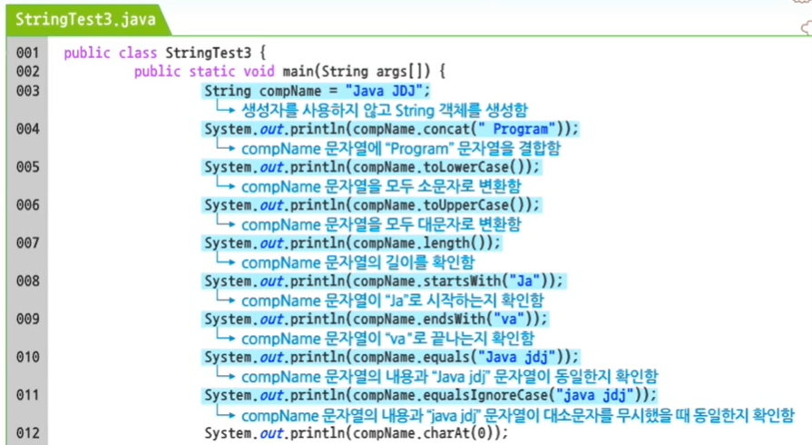

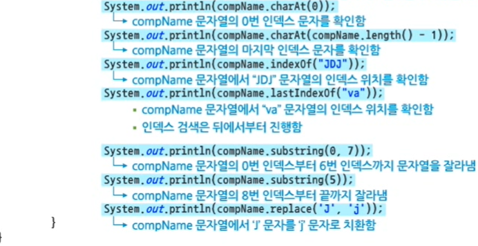

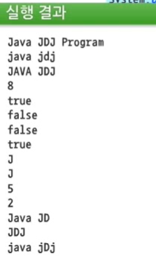

## 2. StringBuffer 클래스