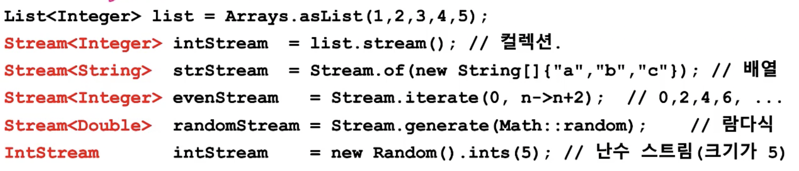
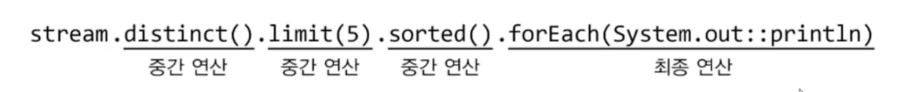
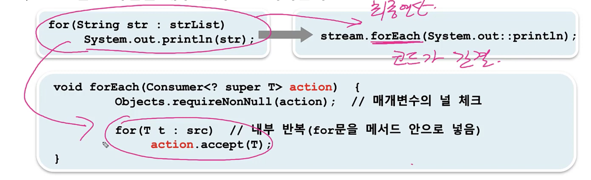

# 스트림 (Stream)
> - 다양한 데이터 소스를 표준화된 방법으로 다루기 위한 것 
> - 컬렉```션 (`List`, `Set`, `Map`), 배열 -> Stream => `중간 연산` -> `최종 연산`  
> 

- 중간 연산 : 연산 결과가 스트림, 반복 가능
- 최종 연산: 연산 결과가 스트림 x 한번만 적용


- 스트림은 데이터 소스로부터 데이터를 읽기만 할 뿐 변경 x
- 스트림은 Iterator처럼 일회용이다. 
- 최종 연산 전까지 중간 연산 수행 x (지연된 연산)

- 스트림은 작업을 내부 반복으로 처리한다.


- 스트림은 작업을 병렬로 처리 - parallel stream (<-> sequence stream)

- 기본 스트림 - IntStream, LongStream, DoubleStream
  - 오토박싱, 언박싱 비효울 제거 (Stream<Integer> 대신 IntStream)
  - 숫자와 관련된 유용한 메서드를 Stream<T>보다 많이 제공


[출처](https://www.youtube.com/watch?v=7Kyf4mMjbTQ&list=PLW2UjW795-f6xWA2_MUhEVgPauhGl3xIp&index=163)