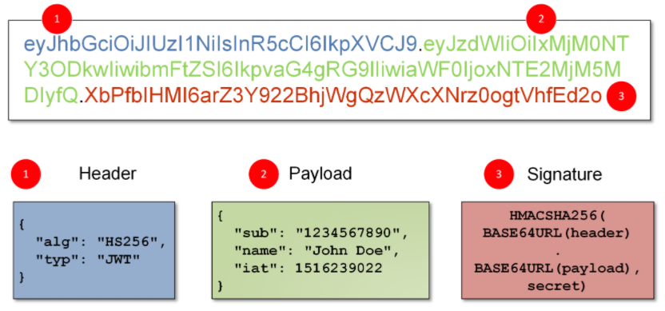

# JWT

생성일: 2021년 8월 11일 오후 11:35

# JWT (Json Web Token)

- JWT란 : JSON 객체를 사용하여 정보를 안전하고 가볍게 전달해주기 위한 토큰
- [JWT 구조](https://jwt.io/)

    

    1. Header : 사용한 해쉬 알고리즘, 암호화된 서명 부분을 해독하는데 쓰임
        - ex) HMAC SHA256, RSA
    2. Payload : 담을 내용, 사용자 ID, 유효기간 등
    3. Signature : 서명 (ID +Password)
    - Header, Payload는 base64로 인코딩되어 누구나 디코딩하여 확인할 수 있다. 그러나 Signature는 Secret Key를 알지 못하면 복호화할 수 없다.
- JWT 사용 과정
    1. 브라우저에서 로그인 시 ID, Password 등 회원 정보를 입력한다.
    2. 서버에서 JWT를 생성하여 브라우저에 보낸다. (이때 Secret Key를 사용하여 Access Token(JWT)를 발행하고 유효기간을 설정한다.)
    3. 브라우저는 서버에 데이터 요청 시 헤더에 Access Token (JWT)을 실어 함께 보낸다.
    4. 서버는 서명을 확인한 후 유저 정보를 클라이언트에 제공한다. (서명을 확인할 때는 Secret Key로 복호화하여 valid한 토큰인지 확인한다.)

    

- [JWT 토큰의 두가지 조건](https://brunch.co.kr/@springboot/491)
    1. 유효한 사용자 (유효한 토큰)인지 검증 (인증)
    2. 리소스에 대한 권한이 있는지 (인가)
- JWT 활용
    1. JWT 인증은 오늘날 인증을 위한 업계 표준 프로토콜인 **`OAuth2`**로 수행된다.
    2. Sercie to Service 인증 : Login with Google, Login with Facebook 과 같은 로그인 옵션이 제공된다. 이것들은 모두 JWT 인증의 적용이다.
- JWT 장점
    - 사용자 인증에 필요한 정보들이 토큰 자체에 포함되어 있어 별도의 인증 저장소가 필요 없다.
    - 토큰 기반으로 하는 다른 인증 시스템 (Google 로그인 등)에 접근 가능하다.
- JWT 단점
    - JWT는 한 번 발급되면 유효기간 만료 전 까지는 계속 사용 가능하므로 정보가 탈취될 수 있다. 반면 세션/쿠키의 경우 세션 ID가 변질되면 세션을 지우면 된다.
    - 따라서 기존의 JWT의 Access Token 유효기간을 짧게 하고 1Refresh Token1이란 새로운 Token을 발급하여 상대적으로 피해를 줄일 수 있다.