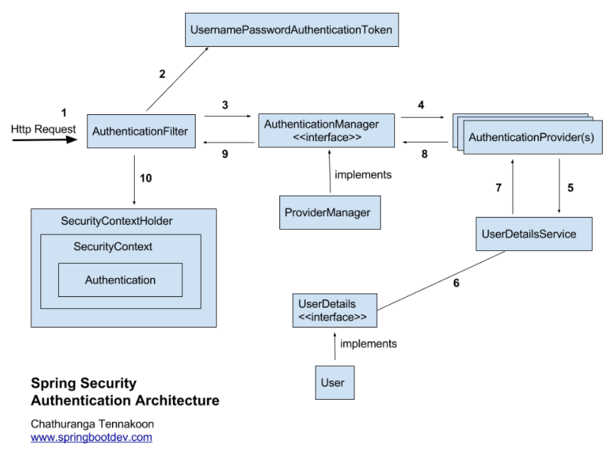

# Spring Security + JWT + OAuth 2.0

생성일: 2021년 8월 11일 오후 11:35

# 보안 관련 용어

- 접근 주체(Principal) : 보호된 대상에 접근하는 유저
- 인증(Authenticate) : 현재 유저가 누구인지 확인(ex. 로그인)
    - 애플리케이션의 작업을 수행할 수 있는 주체임을 증명
- 인가(Authorize) : 현재 유저가 어떤 서비스, 페이지에 접근할 수 있는 권한이 있는지 검사
- 권한 : 인증된 주체가 애플리케이션의 동작을 수행할 수 있도록 허락되어있는지를 결정
    - 권한 승인이 필요한 부분으로 접근하려면 인증 과정을 통해 주체가 증명되어야 한다.
    - 권한 부여에도 두 가지 영역이 존재하는데 웹 요청 권한, 메소드 호출 및 도메인 인스턴스에 대한 접근 권한 부여

Web에서 `인증`은 해당 URL은 보안 절차를 거친 사용자들만 접근할 수 있다는 의미이고,`인가`란 URL에 접근한 사용자가 특정한 자격이 있다는 것을 의미

# Spring Security

- Spring Security는 Spring 기반의 애플리케이션의 보안(인증과 권한, 인가 등)을 담당하는 스프링 하위 프레임워크
- Spring Security는 '인증'과 '권한'에 대한 부분을 Servlet Filter (이하 Filter) 기반으로 한다.
    - 클라이언트가 어플리케이션으로 request를 보내면, Servlet Container는 요청 URI 경로에 따라 어떤 Filter와 어떤 servlet을 적용할 것인지 결정한다.
    - 33개의 Spring Security Filter가 존재한다.
- `Filter`는 `Dispatcher Servlet`으로 가기 전에 적용되므로 가장 먼저 URL 요청을 받지만, `Interceptor`는 `Dispatcher`와 `Controller`사이에 위치한다는 점에서 적용 시기의 차이가 있다.
- Spring Security는 세션-쿠키 방식으로 인증한다. `spring-security-oauth2` 방식인 JWT와 다르기 때문에 별개로 생각해야 한다.
- Spring Security Structure

    Spring Security만 사용할 경우의 로그인 구조다. 

    

    1. 사용자가 로그인 정보와 함께 인증 요청 (`HttpRequest`)
    2. `AuthenticationFilter`가 요청을 가로챔. 이때 가로챈 정보를 통해 `UsernamePasswordAuthenticationToken` 객체 (사용자가 입력한 데이터를 기반으로 생성, 즉 현 상태는 미검증 Authentication) 생성
    3. `ProviderManager` (`AuthenticationManager` 구현체) 에게 `UsernamePasswordAuthenticationToken` 객체를 전달
    4. `AuthenticationProvider`에 `UsernamePasswordAuthenticationToken` 객체를 전달
    5. 실제 DB로 부터 사용자 인증 정보를 가져오는 `UserDetailsService`에 사용자 정보를 넘겨줌
    6. 넘겨받은 정보를 통해 DB에서 찾은 사용자 정보인 `UserDetails` 객체를 생성
    7. `AuthenticationProvider`는 `UserDetails`를 넘겨받고 사용자 정보를 비교
    8. 인증이 완료되면, 사용자 정보를 담은 `Authentication` 객체를 반환
    9. 최초의 `AuthenticationFilter`에 `Authentication` 객체가 반환됨
    10. `Authentication` 객체를 `SecurityContext`에 저장
- 만약 OAuth 2.0 로그인을 사용한다면, `UsernamePasswordAuthenticationFilter` 대신 `OAuth2LoginAuthenticationFilter` 가 호출된다.
    - 두 필터의 상위 클래스는 `AbstractAuthenticationProcessingFilter`이다. 사실 스프링 시큐리티는 `AbstractAuthenticationProcessingFilter`를 호출하고, 로그인 방식에 따라 구현체인 `UsernamePasswordAuthenticationFilter` 와 `OAuth2LoginAuthenticationFilter` 가 동작하는 방식이다.

# Spring Security + JWT

- Spring Security에서는 인증 및 권한 처리를 `UsernamePasswordAuthenticationFilter` 에서 담당한다.
- 그러나, JWT를 사용할 경우 `JwtAuthenticationFilter`와 같은 사용자 정의 Filter가 필요하며, `UsernamePasswordAuthenticationFilter` 전에 수행되도록 `SecurityConfig`에 등록해야 한다.
- `JwtAuthenticationFilter`는 JWT가 유효한 토큰인지 인증하기 위한 Filter다.
- `JwtTokenProvider` : Jwt Token 생성, 인증, 권한 부여, 유효성 검사, PK 추출 등의 기능 제공
- `UserSerivce` : JWT Token Provider가 제공한 사용자 정보로 DB에서 알맞은 사용자 정보를 가져와 `UserDetails`생성 
- `UserDetails` : 현재 액세스 토큰으로 부터 인증된 유저의 부가 상세정보(활성화 여부, 만료, 롤 등) 정의

# OAuth 2.0  (OpenID Authentication)

- OAuth (OpenID Authentication) 란, 타사의 사이트에 대한 접근 권한을 얻고 그 권한을 이용하여 개발할 수 있도록 도와주는 프레임워크
- 개발한 웹 사이트에 구글 ID와 PW를 그대로 전달해주는게 아니라, Access Token을 발급받고, 그 토큰을 기반으로 원하는 기능을 구현한다.
- Access Token : 로그인 하지 않고 인증 할 수 있도록 해주는 인증 토큰.
    - 내가 개발한 웹 사이트로 구글 캘린더 정보 권한을 얻어서 캘린더에 글을 작성하고 삭제하는 등의 작업을 한다.
- Access Token을 발급 받기 위한 일련의 과정들을 인터페이스로 정의해둔 것이 바로 OAuth
- OAuth 2.0 로그인을 할 때 사용하는 여러 방법 중 하나가 JWT다.

## OAuth 용어

- `Resource Owner`: 개인 정보의 소유자를 가리킨다. 유저 `A`가 이에 해당한다.
- `Client`: 제 3의 서비스로부터 인증을 받고자 하는 서버다. 직접 개발한 웹 사이트 `X`가 이에 해당한다.
- `Resource Server`: 개인 정보를 저장하고 있는 서버를 의미한다. 구글이 이에 해당한다.

## OAuth 신청 시 필요한 것들

- `Client ID`: `Resource Server`에서 발급해주는 ID. 웹 사이트 `X`에 구글이 할당한 ID를 알려주는 것이다.
- `Client Secret`: `Resource Server`에서 발급해주는 PW. 웹 사이트 `X`에 구글이 할당한 PW를 알려주는 것이다.
- `Authorized Redirect Uri`: Client 측에서 등록하는 Url. 만약 이 Uri로부터 인증을 요구하는 것이 아니라면, `Resource Server`는 해당 요청을 무시한다.

### reference

[https://bcp0109.tistory.com/301](https://bcp0109.tistory.com/301)

[https://brunch.co.kr/@springboot/491#comment](https://brunch.co.kr/@springboot/491#comment)

[https://velog.io/@tmdgh0221/Spring-Security-와-OAuth-2.0-와-JWT-의-콜라보](https://velog.io/@tmdgh0221/Spring-Security-%EC%99%80-OAuth-2.0-%EC%99%80-JWT-%EC%9D%98-%EC%BD%9C%EB%9D%BC%EB%B3%B4)